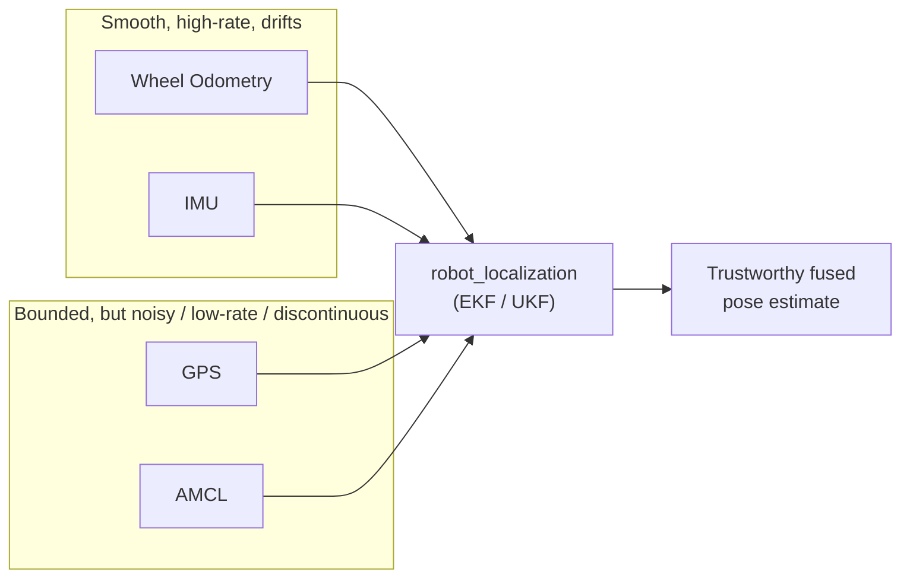

# Fuse Sensor Data to Improve Localization — Unit 1: Introduction to the Course

This unit previews the whole course: why any single localization sensor eventually lets you down, and how the `robot_localization` package lets you combine several imperfect sensors into one trustworthy pose estimate. Everything that follows builds on the concepts introduced here.

The diagram below shows how sensors with complementary failure modes — smooth-but-drifting versus bounded-but-noisy — are combined by `robot_localization` into one fused estimate.



## Why one sensor is never enough

Every localization sensor has a failure mode. Wheel odometry drifts unboundedly over distance because small per-step errors (wheel slip, uneven flooring, calibration error) accumulate. IMUs give you excellent short-term orientation and angular velocity, but their position estimate (from double-integrating acceleration) drifts even faster than odometry. GPS gives you a bounded, drift-free global position, but it is noisy, low-rate, and unusable indoors or under tree canopy. A map-based localizer like AMCL gives you a globally consistent pose, but it depends on having an accurate map and can jump discontinuously when it re-localizes.

The pattern across all of these: each sensor is strong exactly where another is weak. Odometry and IMU are smooth and high-rate but drift; GPS and AMCL are drift-free but noisy, low-rate, or discontinuous. Sensor fusion exploits that complementarity instead of picking a single "best" sensor.

## The tool: robot_localization

`robot_localization` is a ROS package that implements nonlinear state estimators — an Extended Kalman Filter (`ekf_node`) and an Unscented Kalman Filter (`ukf_node`) — for fusing an arbitrary number of sensors that report position, velocity, or acceleration in any combination of the 3D pose state (x, y, z, roll, pitch, yaw, and their derivatives). You will configure it almost entirely through YAML rather than writing filter math yourself. Its documentation lives at docs.ros.org under the `robot_localization` package pages, and it is worth bookmarking now — you will return to the parameter reference constantly.

The filter's job is simple to state and subtle to tune: at every timestep it predicts the robot's state forward using a constant-velocity motion model, then corrects that prediction using whichever sensor measurements arrived, weighting each by how much you trust it (its covariance).

## How this course is organized

- **Unit 2** covers the fusion core: configuring `ekf_node` to merge wheel odometry and an IMU into a single continuous local estimate.
- **Unit 3** adds a second, map-referenced filter instance that incorporates AMCL's global pose corrections without breaking the smoothness of the local estimate.
- **Unit 4** brings GPS into the picture via the `navsat_transform_node`, which converts latitude/longitude into the same Cartesian frame the rest of the system uses.
- **Unit 5** is a mini project where you assemble all of the above into one working localization stack.

## Checking what your robot already publishes

Before you fuse anything, confirm what localization-relevant topics already exist. On a running robot or simulation, list the candidates and inspect one:

```bash
ros2 topic list | grep -Ei "odom|imu|gps|fix|amcl"
ros2 topic echo /odom --once
ros2 topic hz /imu/data
```

Note each topic's message type (`nav_msgs/Odometry`, `sensor_msgs/Imu`, `sensor_msgs/NavSatFix`, `geometry_msgs/PoseWithCovarianceStamped`) and its publish rate — you'll need both when you write EKF configuration in the next unit, since `robot_localization` expects specific message types per input slot and a mismatched or unexpectedly slow topic is one of the most common setup mistakes.

## Try it yourself

Before writing any configuration, sketch (on paper or in a text file) the sensors your own robot — real or simulated — currently has or could plausibly have (e.g. wheel encoders, an IMU, a GPS receiver, a camera-based localizer). For each one, write one sentence on what it's good at and one sentence on how it fails. You'll reuse this list as the input list for the EKF configuration in Unit 2.
