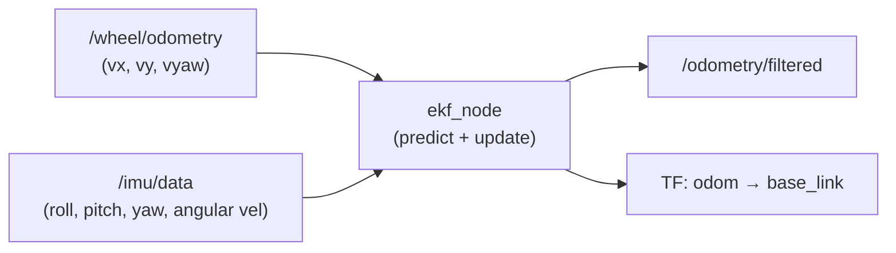

# Fuse Sensor Data to Improve Localization — Unit 2: Merging Sensor Data

This unit is the heart of the course: taking wheel odometry and an IMU and fusing them with `robot_localization`'s `ekf_node` into a single, smoother, drift-resistant pose estimate on the `odom` → `base_link` transform chain.

The diagram below shows how the two continuous sensor topics flow into `ekf_node` and out as the filtered odometry and transform this unit builds.



## How the EKF fuses data

The Extended Kalman Filter alternates two steps. The **predict** step advances the state estimate using a motion model (robot_localization defaults to a constant-velocity model) and grows the state's uncertainty (covariance) to reflect the fact that nothing was measured in between. The **update** step folds in a new sensor reading, using that reading's own covariance to decide how much it should pull the state estimate toward it — a low-covariance (confident) measurement pulls hard, a high-covariance (noisy) one barely moves the estimate. Because the filter tracks covariance for every state variable, it naturally handles sensors that only observe *some* of the state — an IMU reports orientation and angular velocity but not position, and that's fine.

## Configuring sensor inputs

Each sensor you fuse gets a numbered parameter block in the EKF's YAML config, plus a 15-element boolean mask (`config`) that says which of the 15 state variables `[x, y, z, roll, pitch, yaw, vx, vy, vz, vroll, vpitch, vyaw, ax, ay, az]` that sensor is allowed to update:

```yaml
ekf_filter_node:
  ros__parameters:
    frequency: 30.0
    two_d_mode: true
    odom_frame: odom
    base_link_frame: base_link
    world_frame: odom

    odom0: /wheel/odometry
    odom0_config: [false, false, false,
                   false, false, false,
                   true,  true,  false,
                   false, false, true,
                   false, false, false]
    odom0_differential: false

    imu0: /imu/data
    imu0_config: [false, false, false,
                  true,  true,  true,
                  false, false, false,
                  true,  true,  true,
                  false, false, false]
    imu0_differential: false
    imu0_remove_gravitational_acceleration: true
```

Here wheel odometry contributes linear x/y velocity and yaw velocity (it should *not* also contribute absolute yaw — that would double-count with the IMU and fight it), while the IMU contributes absolute roll/pitch/yaw and all three angular velocities. This division of labor — let each sensor speak only to the states it genuinely measures well — is the single most important tuning decision you'll make.

## Running the node and inspecting the output

Launch the filter (either directly or through your own launch file that loads the YAML) and watch its output odometry:

```bash
ros2 run robot_localization ekf_node --ros-args --params-file ekf.yaml
ros2 topic echo /odometry/filtered
```

Compare `/odometry/filtered` against the raw `/wheel/odometry` topic side by side, or plot both in `rqt_plot` / `PlotJuggler`. A well-tuned filter should look like a smoothed, less noisy version of the raw odometry — not a wildly different trajectory. Also check `ros2 run tf2_tools view_frames` (or `ros2 run tf2_ros tf2_echo odom base_link`) to confirm the filter is actually publishing the `odom → base_link` transform your navigation stack expects.

## Tuning process noise

If the fused output lags behind real motion, your `process_noise_covariance` is too low (the filter trusts its own prediction too much). If it's jittery, it's too high, or your sensor covariances are too small relative to the actual sensor noise. Start from the package's example config, change one covariance value at a time, and re-run — resist the urge to tune multiple parameters simultaneously, since EKF tuning is a game of isolating cause and effect.

## Try it yourself

Take the sensor list you wrote in Unit 1. For each sensor, write out its 15-element `config` mask by hand, deciding exactly which state variables it should be allowed to update — and, for any pair of sensors that could both claim the same state variable (e.g. two sources of yaw), decide which one wins and why.
