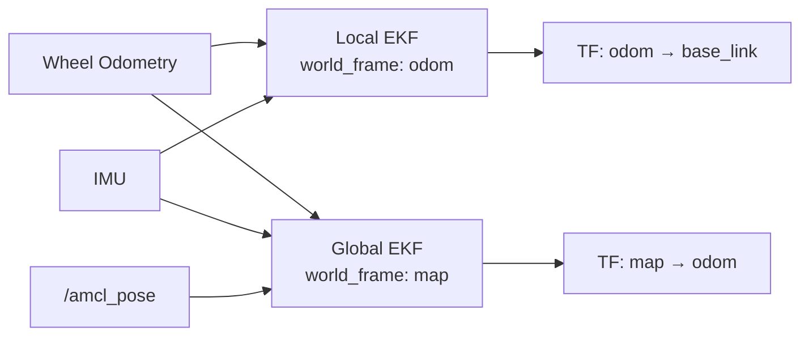

# Fuse Sensor Data to Improve Localization — Unit 3: Using an External Localization System

Here you combine `robot_localization` with AMCL, a map-based particle-filter localizer that is external to (not part of) the `robot_localization` package. The goal is to get AMCL's global corrections without losing the smooth, high-rate local estimate you built in Unit 2.

The diagram below shows the two-instance EKF pattern this unit introduces: a local filter that never sees AMCL, and a global filter that absorbs AMCL's corrections on its own transform link.



## What AMCL provides, and where it falls short

AMCL (Adaptive Monte Carlo Localization) matches incoming laser scans against a known static map to estimate the robot's pose in the `map` frame. Its strength is that it is globally referenced and bounded — it does not drift over long runs the way odometry does. Its weaknesses: it typically runs at a lower rate than odometry/IMU, its pose estimate can be noisy scan-to-scan, and when it re-localizes (e.g. after the robot was picked up, or through the "kidnapped robot" recovery), its output can *jump* discontinuously. Feeding that jumpy signal directly into your smooth local EKF would corrupt the very smoothness you just built.

## The two-instance EKF pattern

The standard `robot_localization` pattern for this is to run **two** `ekf_node` instances:

- A **local** instance (the one from Unit 2) fuses only continuous sensors — wheel odometry and IMU — and publishes the `odom → base_link` transform. This estimate is always smooth and never jumps, which is exactly what local costmaps and control loops need.
- A **global** instance fuses the same continuous sensors *plus* AMCL's pose, and publishes the `map → odom` transform instead of `map → base_link` directly. Because AMCL's corrections land on the `map → odom` link rather than on `odom → base_link`, any jump gets absorbed there, and the robot's local frame stays smooth even as its global frame snaps into alignment.

```
map --(global EKF, corrected by AMCL)--> odom --(local EKF)--> base_link
```

This is why `robot_localization` exposes `world_frame` as a configurable parameter: for the local instance you set `world_frame: odom`, and for the global instance you set `world_frame: map`.

## Feeding AMCL's pose into the global filter

AMCL publishes `geometry_msgs/PoseWithCovarianceStamped` on `/amcl_pose`. You add it to the global EKF's config as a `pose0` source:

```yaml
ekf_filter_node_map:
  ros__parameters:
    frequency: 30.0
    two_d_mode: true
    odom_frame: odom
    base_link_frame: base_link
    world_frame: map

    odom0: /wheel/odometry
    odom0_config: [false, false, false, false, false, false,
                   true, true, false, false, false, true,
                   false, false, false]

    imu0: /imu/data
    imu0_config: [false, false, false, true, true, true,
                  false, false, false, true, true, true,
                  false, false, false]

    pose0: /amcl_pose
    pose0_config: [true, true, false, false, false, true,
                   false, false, false, false, false, false,
                   false, false, false]
    pose0_differential: false
    pose0_rejection_threshold: 5.0
```

`pose0_rejection_threshold` guards against a single wildly wrong AMCL update yanking your global estimate — set it in terms of Mahalanobis distance so that occasional bad scans get discarded rather than fused.

## Frame chain and TF sanity checks

With both instances running, exactly one node should publish each transform: the local EKF publishes `odom → base_link`, the global EKF publishes `map → odom`, and AMCL — when running alongside `robot_localization` — should be configured *not* to publish `map → odom` itself (check the `tf_broadcast` parameter on AMCL). Verify the full chain with:

```bash
ros2 run tf2_ros tf2_echo map base_link
ros2 run tf2_tools view_frames
```

If you see TF errors about multiple parents for the same frame, two nodes are fighting over the same transform — that's almost always this AMCL/EKF broadcast conflict.

## Try it yourself

Draw the TF tree for the two-EKF setup described above (map, odom, base_link, and your sensor frames), labeling each arrow with which node publishes it. Then identify: if AMCL briefly loses tracking and its covariance spikes, which frame absorbs the resulting correction, and why does `base_link` never see a discontinuity?
