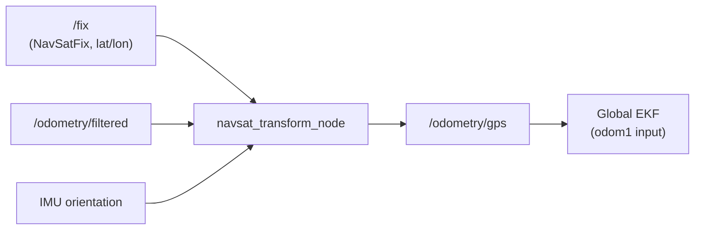

# Fuse Sensor Data to Improve Localization — Unit 4: GPS Navigation

This unit extends the fusion pipeline outdoors, replacing (or complementing) AMCL's map-based global correction with GPS. GPS cannot be fed into `ekf_node` directly — it needs a translation step first, which is what this unit is about.

The diagram below shows how `navsat_transform_node` sits between the raw GPS fix and the global EKF, converting geographic coordinates into a Cartesian odometry topic the filter can consume.



## Why GPS needs a transform node first

GPS reports latitude, longitude, and altitude in geographic coordinates, while everything else in your stack works in a local Cartesian frame (`map`/`odom`, in meters). You also don't automatically know how your `map` frame's origin and axis orientation relate to true north. `robot_localization` solves both problems with `navsat_transform_node`, which converts geographic GPS fixes into a local ENU (East-North-Up) Cartesian frame anchored at a reference point (the "datum"), aligned using your filtered odometry's heading.

## Configuring navsat_transform_node

```yaml
navsat_transform:
  ros__parameters:
    frequency: 30.0
    delay: 3.0
    magnetic_declination_radians: 0.0523599   # look up for your location
    yaw_offset: 0.0
    zero_altitude: true
    broadcast_utm_transform: false
    publish_filtered_gps: true
    use_odometry_yaw: true
    wait_for_datum: false
```

Key parameters:
- `magnetic_declination_radians` corrects for the difference between magnetic north (what a compass/IMU reports) and true north (what GPS coordinates are referenced to). Get this value for your location from a magnetic declination calculator and set it precisely — an error here shows up as a slow rotational drift between your GPS-corrected estimate and reality.
- `use_odometry_yaw: true` tells the node to take initial heading from your already-fused odometry/IMU estimate rather than requiring two GPS fixes to infer heading by movement.
- `wait_for_datum` / the `datum` parameter fixes the local frame's origin to a specific lat/lon rather than "wherever the robot happened to be at startup," which matters if you need repeatable runs.

The node subscribes to raw `sensor_msgs/NavSatFix`, your fused `odometry/filtered`, and IMU orientation, and publishes `odometry/gps` — a standard `nav_msgs/Odometry` message in your local Cartesian frame, ready to feed straight into an EKF like any other odometry source.

## Fusing GPS into the global filter

Add `odometry/gps` as another `odom` input on your global (map-frame) EKF instance from Unit 3, alongside or instead of AMCL's `pose0`:

```yaml
    odom1: /odometry/gps
    odom1_config: [true, true, false, false, false, false,
                   false, false, false, false, false, false,
                   false, false, false]
    odom1_differential: false
```

Note GPS only contributes x/y position, not velocity or orientation — let odometry and IMU keep supplying those. Run the whole chain and confirm with `ros2 topic hz /fix` and `ros2 topic echo /odometry/gps` that fixes are actually flowing before you spend time debugging the filter itself.

## Practical GPS caveats

Consumer-grade GPS has multi-meter error and is prone to multipath near buildings and under tree canopy; RTK-corrected GPS gets you to centimeter accuracy but needs a base station or correction service. GPS is unusable indoors — a robot that transitions indoor/outdoor needs a strategy for gracefully handing off between GPS-based and AMCL-based (or GPS-denied) global correction rather than assuming one source is always available. Always sanity-check a new GPS unit outdoors with clear sky view before assuming a bad fusion result is the filter's fault rather than the antenna's.

## Try it yourself

Look up the magnetic declination for a real location (e.g. your city) using any declination reference, convert it to radians, and write out the complete `navsat_transform_node` config block for a robot operating there, including your chosen `datum` coordinates.
