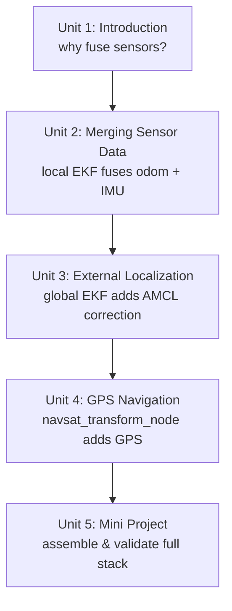

# Fuse Sensor Data to Improve Localization

Any single localization sensor is flawed in a different way — wheel odometry and IMUs drift, GPS and AMCL are noisy, low-rate, or discontinuous — and this course teaches you to combine them into one trustworthy pose estimate using the `robot_localization` package. You'll build a local EKF that fuses continuous sensors (odometry, IMU) for smooth control, layer a second global EKF that incorporates map-based (AMCL) or geographic (GPS, via `navsat_transform_node`) corrections without breaking that smoothness, and finish by assembling and validating the whole pipeline end to end.

The diagram below shows how each unit builds directly on the one before it, from the fusion core to the final assembled and validated pipeline.

1. [Introduction to the Course](01-introduction-to-the-course.md) — Unit for previewing the contents of the Course.
2. [Merging sensor data](02-merging-sensor-data.md) — Learn how to use the robot_localization package to merge data from different sensors in order to improve the pose estimation for localizing your robot.
3. [Using an external Localization system](03-using-an-external-localization-system.md) — Learn how to use the robot_localization package in combination with an AMCL system external to it.
4. [GPS Navigation](04-gps-navigation.md) — Learn how to combine robot_localization with an external GPS source.
5. [Mini Project](05-mini-project.md) — Final project, where you will have to combine everything you've learned during the course.
