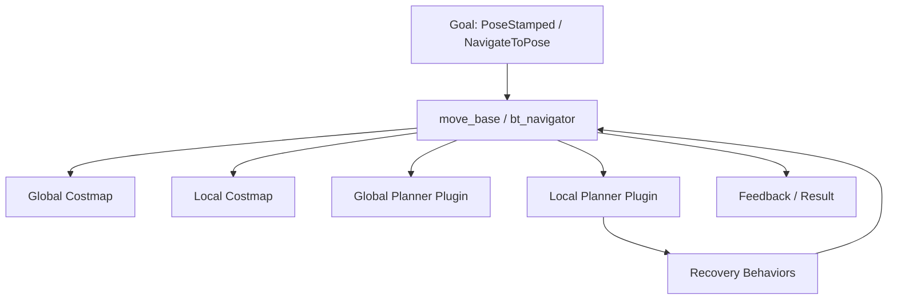

# ROS Navigation in 5 Days — Unit 2: Basic Concepts

Unit 1 gave you the parts list. This unit zooms into the piece that orchestrates everything else — `move_base` in ROS 1, or its behavior-tree-driven equivalent in ROS 2 — and explains what it needs from you to run at all.

The diagram below shows move_base as the central orchestrator: it owns both costmaps, calls out to the planner plugins, escalates to recovery when stuck, and reports back to whoever sent the goal:



## What the Navigation Stack actually is

The Navigation Stack is a *framework*, not a fixed algorithm. It defines interfaces — costmap layers, global planner plugins, local planner (controller) plugins, recovery behavior plugins — and ships default implementations for each. This is why you'll see wildly different-looking robots (a warehouse AGV, a vacuum, a research rover) all built on "the same" nav stack: they're using the same skeleton with different plugins and parameters plugged in. Understanding it means understanding the skeleton, not memorizing one robot's config file.

## What you need before you can even launch it

At minimum:

- A **robot description** (URDF/xacro) so the stack knows the robot's footprint (used for collision checking against costmaps).
- Working **odometry and TF**, as covered in Unit 1.
- A **map**, even a trivial empty one, because the global costmap needs something to layer obstacles onto.
- A **base controller** that turns `cmd_vel` into actual motion (or simulated motion).

Nothing in the nav stack replaces these — it consumes them.

## The move_base node (and its ROS 2 shape)

`move_base` is a ROS 1 action server. You send it a `geometry_msgs/PoseStamped` goal via the `move_base_msgs/MoveBaseAction` interface, and it handles everything until the robot arrives, fails, or you cancel:

```bash
# ROS 1 — send a goal from the command line
rostopic pub /move_base_simple/goal geometry_msgs/PoseStamped '{header: {frame_id: "map"}, pose: {position: {x: 2.0, y: 1.0, z: 0.0}, orientation: {w: 1.0}}}'
```

In ROS 2, the same job is split between `bt_navigator` (which runs a behavior tree deciding *when* to plan, recompute, or recover) and separate `planner_server` / `controller_server` nodes it calls into. You send goals through the `nav2_msgs/NavigateToPose` action instead of a plain topic:

```bash
# ROS 2 — send a goal via the action interface
ros2 action send_goal /navigate_to_pose nav2_msgs/action/NavigateToPose \
  "{pose: {header: {frame_id: 'map'}, pose: {position: {x: 2.0, y: 1.0, z: 0.0}, orientation: {w: 1.0}}}}"
```

The move to an explicit behavior tree in ROS 2 is why Nav2 is far easier to extend with custom recovery logic (e.g. "try spinning in place, then back up, then clear the costmap") — you edit or swap the tree's XML instead of patching C++ inside a monolith.

## Why move_base matters so much

Everything you'll configure in Units 3–6 is consumed by this orchestrator:

- It owns the **global and local costmaps** and keeps them updated.
- It calls the **global planner** plugin whenever a new goal arrives (and periodically, if configured, to replan).
- It calls the **local planner** (controller) plugin at a fixed control frequency to produce the next `cmd_vel`.
- It triggers **recovery behaviors** (clearing costmaps, rotating in place, aborting) when the local planner reports it's stuck.
- It reports action feedback (current pose, distance remaining) and a final result (succeeded, aborted, or preempted) back to whoever sent the goal.

## What runs inside it

A typical `move_base`/Nav2 stack you'll configure over the next four units:

| Piece | Role |
|---|---|
| Global costmap | Static map + inflation, used for long-range planning |
| Local costmap | Rolling window of live sensor data, used for immediate obstacle avoidance |
| Global planner | Computes a full path (e.g. Dijkstra/A* over the global costmap) |
| Local planner / controller | Turns the path into velocity commands, dodging what the global plan didn't know about |
| Recovery behaviors | Get the robot unstuck when the controller can't make progress |

## Try it yourself

With your simulated robot and an empty or trivial map running, send a navigation goal a few meters away using the CLI command for your ROS version above. Watch `ros2 topic echo /cmd_vel` (or `rostopic echo`) while it drives, and note roughly how many messages per second arrive — that's your controller's control frequency, a parameter you'll tune explicitly in Unit 6.
