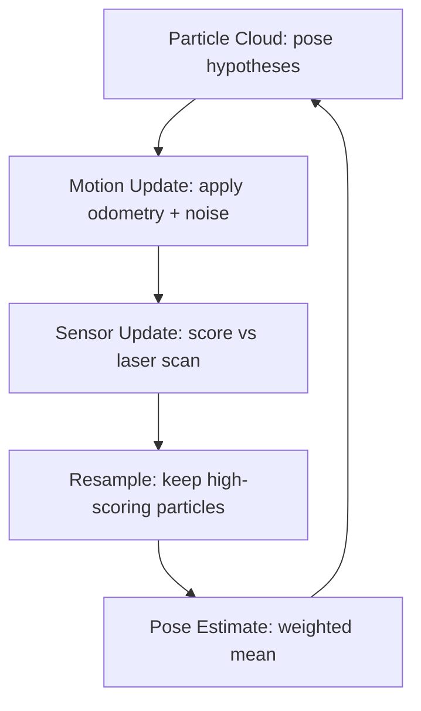

# ROS Navigation in 5 Days — Unit 4: Robot Localization

A map is useless if the robot doesn't know where it is on it. This unit covers what "localization" means precisely in ROS Navigation, the particle-filter algorithm that solves it by default, and how to configure and monitor it in practice.

The diagram below shows the AMCL cycle described in the next section — the same five steps repeating on every odometry and scan update:



## What localization means here

Note the distinction: **odometry** gives you a *relative* pose that drifts over time (wheel slip, integration error accumulate endlessly). **Localization** gives you an *absolute* pose on the map by continuously correcting that drifting estimate against sensor observations. Concretely, localization's job is to maintain the `map -> odom` transform — odometry already gives you `odom -> base_link`, and together those compose into `map -> base_link`, the pose the rest of the stack actually cares about.

This is why a healthy nav stack has *two* frames between the world and the robot instead of one: `odom` absorbs continuous, jump-free small corrections (nice for controllers), while `map` is the true, occasionally-jumpy corrected frame (nice for global consistency).

## How AMCL (particle-filter localization) works

AMCL — Adaptive Monte Carlo Localization — is the default localizer in both ROS 1 and ROS 2's Nav2. The idea:

1. Maintain a cloud of **particles**, each a hypothesis of the robot's pose (x, y, θ).
2. On each odometry update, move every particle by the same motion, plus noise (the *motion model*).
3. On each laser scan, score every particle by how well the scan would match the map *if* the robot were really at that particle's pose (the *sensor model*).
4. **Resample**: keep more copies of high-scoring particles, fewer of low-scoring ones.
5. The reported pose estimate is (roughly) the weighted mean of the particle cloud; its spread reflects your current uncertainty.

"Adaptive" refers to AMCL dynamically shrinking or growing the number of particles based on how confident the estimate is — fewer particles once it's converged, more while it's still uncertain (e.g., right after startup, before you've told it where the robot begins).

## Setting the initial pose and tuning AMCL

AMCL doesn't know where the robot starts — you must tell it, or it initializes with the cloud spread across the whole map and waits for enough movement and scan matches to converge. Set the initial pose explicitly to skip that:

```bash
# ROS 2
ros2 topic pub -1 /initialpose geometry_msgs/msg/PoseWithCovarianceStamped \
  "{header: {frame_id: 'map'}, pose: {pose: {position: {x: 0.0, y: 0.0, z: 0.0}, orientation: {w: 1.0}}}}"
```

(In practice you'll usually do this by clicking "2D Pose Estimate" in RViz, which publishes the same message.)

Key tuning parameters, in `amcl` (ROS 1) or `nav2_amcl` (ROS 2):

```yaml
amcl:
  ros__parameters:
    min_particles: 500
    max_particles: 2000
    update_min_d: 0.2        # min translation (m) before updating
    update_min_a: 0.2        # min rotation (rad) before updating
    laser_max_range: 20.0
    odom_alpha1: 0.2         # motion noise params — raise if odometry drifts more than expected
    odom_alpha2: 0.2
    odom_alpha3: 0.2
    odom_alpha4: 0.2
```

If localization keeps "jumping" unexpectedly, suspect either a bad initial pose, too little sensor overlap with the map (featureless corridors are notoriously hard), or motion-model noise parameters set too low for your robot's actual odometry error.

## A note on sensor fusion (and where it belongs)

AMCL fuses *one* pose source (laser-vs-map) with odometry. If you have an IMU, GPS, or multiple odometry sources you want fused into a smoother, more robust pose estimate *before* it ever reaches AMCL, that's the job of a separate Extended Kalman Filter node (`robot_localization`'s `ekf_node`), not AMCL itself. That's deep enough to be its own course — see "Fuse Sensor Data to Improve Localization" if you want to go further than this unit does.

## Try it yourself

With a saved map and AMCL running, set an *intentionally wrong* initial pose (a few meters off from where the robot actually is) and drive the robot a short distance. Watch `ros2 topic echo /amcl_pose` and the particle cloud in RViz (`PoseArray` on `/particle_cloud`) and observe how many meters of travel it takes before the estimate converges back onto the true pose.
