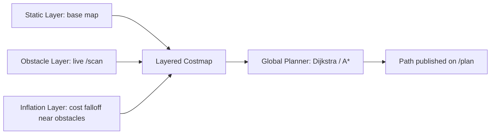

# ROS Navigation in 5 Days — Unit 5: Path Planning I

With a map and a localized robot in hand, the remaining question is how to get from here to a goal. This unit covers the global side of that question: costmaps, what they represent, and the global planner that turns them into a route.

The diagram below shows how the three costmap layers stack into one combined costmap before the global planner searches it for a path:



## Global vs. local planning, and why it's split in two

The Navigation Stack deliberately splits "get to the goal" into two separate problems running at different rates:

- **Global planning** computes a full path from start to goal over the (mostly static) global costmap. It runs once per goal, or occasionally to replan, and doesn't need to be fast — correctness and a sensible route matter more than latency.
- **Local planning** (Unit 6) turns a short lookahead segment of that path into actual velocity commands, tens of times per second, reacting to obstacles the global map never knew about.

This unit is about the first half — you can't reason about local planning sensibly without understanding what path it's trying to follow and why.

## Costmaps: the shared data structure both planners read

A costmap is a 2D grid, like a map, but where every cell holds a **cost** rather than a binary occupied/free flag. It's built from **layers**, stacked and combined:

- **Static layer** — the base map from Unit 3, marking permanently occupied cells.
- **Obstacle layer** — live sensor data (current laser scan / point cloud), marking obstacles the static map doesn't know about.
- **Inflation layer** — expands cost outward from every obstacle, so cells near a wall are expensive (but not impassable) rather than only the wall cell itself being marked. This is what keeps the robot from hugging walls or clipping corners.

There are two costmap instances, not one:

- **Global costmap**: covers the whole map, static-layer-heavy, updated less frequently.
- **Local costmap**: a small rolling window centered on the robot, obstacle-layer-heavy, updated at high frequency — this is what actually protects the robot from things that just walked in front of it.

A minimal costmap config illustrates the layering:

```yaml
global_costmap:
  ros__parameters:
    global_frame: map
    robot_base_frame: base_link
    resolution: 0.05
    plugins: ["static_layer", "obstacle_layer", "inflation_layer"]
    inflation_layer:
      plugin: "nav2_costmap_2d::InflationLayer"
      inflation_radius: 0.55
      cost_scaling_factor: 3.0
    obstacle_layer:
      plugin: "nav2_costmap_2d::ObstacleLayer"
      observation_sources: scan
      scan:
        topic: /scan
        max_obstacle_height: 2.0
```

`inflation_radius` should be at least your robot's turning radius or half-width plus a safety margin; `cost_scaling_factor` controls how sharply cost falls off with distance — higher values mean the robot is willing to cut closer to obstacles.

## The global planner

The default global planner (NavFn in classic ROS 1, or `NavFn`/`SmacPlanner`/`ThetaStar` plugins in Nav2) treats the costmap as a weighted graph and searches it — conceptually Dijkstra's algorithm or A*, where cell cost adds to path cost, so the planner naturally prefers routes that stay away from obstacles even when a shorter, closer-to-the-wall route exists. You can watch it work directly:

```bash
ros2 run nav2_planner planner_server --ros-args --params-file nav_params.yaml
# in RViz, set a 2D Nav Goal and observe the global path (usually a green line) update
```

Or from the CLI, ask for a plan without executing it (Nav2 exposes this as a service in most configurations), or just observe the `/plan` topic:

```bash
ros2 topic echo /plan --once
```

## Try it yourself

With your map, localization, and costmaps running, publish two very different `inflation_radius` values (e.g. 0.1 and 0.8) and re-send the same navigation goal each time. Compare the resulting global paths in RViz — you should see the higher inflation radius push the path further from walls and through wider gaps only, sometimes refusing a route the lower value happily takes through a narrow doorway.
