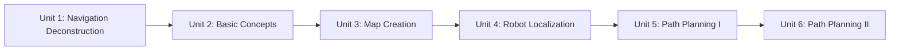

# ROS Navigation in 5 Days

Navigation is what turns a robot that can sense and move into one that can be told "go there" and trusted to figure out how. This course walks through the ROS Navigation Stack end to end — from the pipeline of nodes that make it up, through building a map with SLAM, localizing the robot on that map, and finally planning and following paths around obstacles both known and unexpected. Each unit builds on the last: by the end you should be able to look at a stalled or misbehaving navigation stack and know which layer (TF, localization, costmaps, planner, or controller) to look at first.

The diagram below shows how each unit's output becomes the next unit's input, from parts list to a fully tuned local planner:

1. [ROS Navigation Deconstruction](01-ros-navigation-deconstruction.md) — Gives you the basic tools and knowledge to be able to understand and create any basic ROS Navigation related project.
2. [Basic Concepts](02-basic-concepts.md) — What is the ROS Navigation Stack, what do I need to work with the Navigation Stack, what is the move_base node and why it is so important and which parts take place in the move_base node.
3. [Map Creation](03-map-creation.md) — What means Mapping in ROS Navigation, how does ROS Mapping work, how to configure ROS to make mapping work with almost any robot and different ways to build a Map.
4. [Robot Localization](04-robot-localization.md) — What means Localization in ROS Navigation, how does Localization work and how do we perform Localization in ROS.
5. [Path Planning I](05-path-planning-i.md) — What means Path Planning in ROS Navigation, how does Path Planning work, how does the move_base node work and what is a Costmap.
6. [Path Planning II](06-path-planning-ii.md) — What means Path Planning in ROS Navigation, how does Path Planning work, how does the move_base node work and what is a Costmap.
