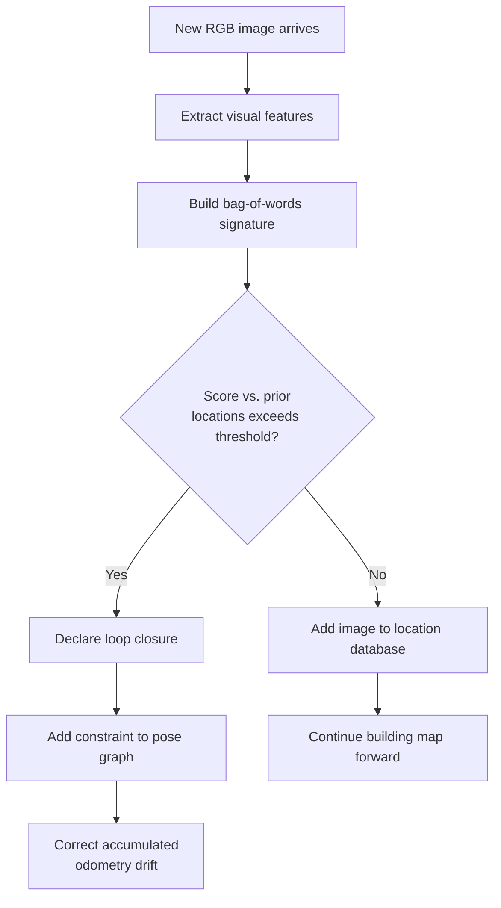

# RTAB-Map in ROS 101 — Unit 2: Basic Concepts

Before you launch a full mapping session, you need to understand the moving parts inside RTAB-Map: the nodes that make up `rtabmap_ros`, how loop closure detection actually decides "have I been here before," and how the memory-management model keeps things running in real time. This unit builds that mental model so the pipeline you run in Unit 3 stops being a black box.

The flowchart below traces the per-frame decision RTAB-Map's loop closure detector makes every time a new image comes in:



## The `rtabmap_ros` node graph

`rtabmap_ros` is not one monolithic node — it's a small pipeline of cooperating nodes, typically:

- **An odometry node** (`rgbd_odometry` or `stereo_odometry`) — estimates the camera's frame-to-frame motion from visual features, publishing `nav_msgs/Odometry` and a `tf` transform (commonly `odom -> base_link`).
- **The `rtabmap` node itself** — subscribes to the RGB image, depth image, camera_info, and the odometry/tf, and does the actual SLAM: building the map graph, running loop closure detection, and publishing the occupancy grid and 3D map.
- **Optional visualization** — `rtabmapviz` or RViz, subscribing to the published map and graph topics so you can watch loop closures happen live.

You can inspect this wiring directly once nodes are up:

```bash
ros2 node list
ros2 node info /rtabmap
ros2 topic list | grep rtabmap
```

Key topics to know by name (exact names can shift slightly with remapping, but these are the conventional ones): `/rtabmap/mapData`, `/rtabmap/mapGraph`, `/rtabmap/grid_map` (an `OccupancyGrid`), and `/rtabmap/cloud_map` (the accumulated 3D point cloud).

## Loop closure detection: the appearance-based part

This is the concept that distinguishes RTAB-Map from purely geometric SLAM. Every time a new RGB image comes in, RTAB-Map extracts visual features (e.g. SURF/ORB-style keypoints, depending on configuration) and converts them into a **bag-of-words** signature — a compact representation of "what this image roughly contains," independent of exact pixel positions. It then compares that signature against signatures of previously visited locations stored in memory.

- If the comparison score against some prior location exceeds a threshold, RTAB-Map declares a **loop closure**: it adds a constraint to the pose graph saying "the robot is here again," which lets it correct accumulated odometry drift retroactively across the whole trajectory.
- If no match is found, the current image is simply added to the database of known locations, and the robot continues building the map forward.

This is conceptually similar to how you might deduplicate images by a perceptual hash rather than a byte-for-byte comparison — RTAB-Map is asking "does this look like somewhere I've seen," not "does this align pixel-for-pixel."

## Memory management: why it stays real-time

Naively, comparing every new image against *every* previously seen image would get slower and slower as the map grows — an obvious non-starter for a robot exploring for an hour. RTAB-Map solves this with a two-tier memory model:

- **Working Memory (WM)** — a bounded set of the most recently/frequently relevant locations, which is what loop closure detection actively searches against. This keeps the per-frame search cost roughly constant.
- **Long-Term Memory (LTM)** — locations that get "demoted" out of Working Memory when it fills up. They're not discarded — they're retrievable if the robot later returns to that area — but they don't cost search time while they're inactive.

This WM/LTM split is the mechanism that makes the "Real-Time" in the name true in practice, rather than only in small demo environments.

## Try it yourself

Without running anything, sketch (on paper or in a text file) the node graph you'd expect from a stereo camera setup instead of RGB-D: which node replaces `rgbd_odometry`, and which topics would change name accordingly. Then, once you do have `rtabmap_ros` nodes running against any data source, run `ros2 topic hz /rtabmap/mapGraph` while moving the camera in a loop back to a starting point, and watch for a jump/discontinuity in the graph update — that's a loop closure event being processed.
