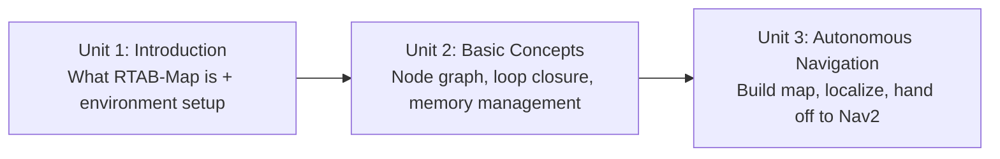

# RTAB-Map in ROS 101

RTAB-Map (Real-Time Appearance-Based Mapping) is an RGB-D/stereo SLAM library built around visual loop closure detection — rather than relying only on laser-scan geometry, it uses a bag-of-words comparison over camera images to recognize places the robot has already visited, and produces both a 2D occupancy grid and a full 3D map of the environment. This course walks through the `rtabmap_ros` package end to end: what the library is and how it's wired into ROS, how its loop closure detector and memory management actually work internally, and finally how to use it to build a map, localize inside that map, and drive a robot autonomously with the result.

The diagram below shows how each unit builds directly on the one before it, from core concepts to a fully autonomous navigation pipeline:

1. [Introduction to the Course](01-introduction-to-the-course.md) — A brief introduction to the contents of the course
2. [Basic Concepts](02-basic-concepts.md) — Some basic concepts of RTAB-Map and the `rtabmap_ros` package
3. [Autonomous Navigation with rtabmap_ros](03-autonomous-navigation-with-rtabmap_ros.md) — Create a map, localize your robot, and perform autonomous navigation with the `rtabmap_ros` package
