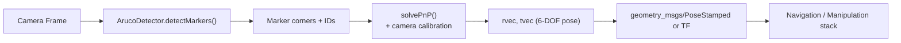

# OpenCV Basics for Robotics — Unit 5: ARTags (Augmented Reality)

Where Unit 4's feature matching gives approximate, sometimes-unreliable correspondences, fiducial markers (AR tags) give a robot near-perfect, unambiguous identification and pose estimation for anything you're willing to stick a printed marker on.

The diagram below traces a marker from detection in a camera frame through to a pose the rest of the robot's stack can consume.



## What ArUco markers are and why robots use them
An ArUco marker is a square black-and-white grid pattern, like a simplified QR code, drawn from a known dictionary of patterns designed to be robustly distinguishable and to detect and correct bit errors from partial occlusion or blur. Because the marker's real-world size and the camera's intrinsic calibration are known, detecting the four corners of a marker in an image is enough to solve for its full 6-DOF pose (position and orientation) relative to the camera. This is dramatically more reliable than natural-feature matching and is why AR tags are so common in robotics for tasks like docking stations, calibration rigs, warehouse shelf identification, and pick-and-place targets — cheap to deploy, unambiguous to read, and precise enough for manipulation.

## Detecting markers
```python
import cv2

aruco_dict = cv2.aruco.getPredefinedDictionary(cv2.aruco.DICT_4X4_50)
detector_params = cv2.aruco.DetectorParameters()
detector = cv2.aruco.ArucoDetector(aruco_dict, detector_params)

corners, ids, rejected = detector.detectMarkers(gray)
if ids is not None:
    cv2.aruco.drawDetectedMarkers(frame, corners, ids)
```

`DICT_4X4_50` means a 4x4-bit grid with 50 unique IDs in the dictionary — smaller dictionaries (fewer bits, fewer IDs) are more robust to detection at a distance or in poor lighting; larger dictionaries support more distinct markers but need to be seen more clearly. Pick the smallest dictionary that gives you enough unique IDs for your use case.

## Estimating pose
With camera calibration parameters (the intrinsic matrix and distortion coefficients, obtained once via a standard checkerboard calibration procedure) and the marker's real-world side length, you can recover each marker's pose directly:

```python
marker_length = 0.05  # meters
obj_points = cv2.aruco.getBoardObjectAndImagePoints  # or build manually per marker
rvecs, tvecs = [], []
for c in corners:
    success, rvec, tvec = cv2.solvePnP(
        marker_3d_points, c, camera_matrix, dist_coeffs
    )
    rvecs.append(rvec)
    tvecs.append(tvec)
    cv2.drawFrameAxes(frame, camera_matrix, dist_coeffs, rvec, tvec, marker_length * 0.5)
```

`tvec` gives the marker's translation (position) relative to the camera in the same units as `marker_length`; `rvec` is a Rodrigues-encoded rotation you can convert to a rotation matrix or quaternion with `cv2.Rodrigues`. In a ROS system, this pose typically gets published as a `geometry_msgs/PoseStamped` or broadcast as a TF transform so the rest of the navigation/manipulation stack can consume it without caring how it was computed.

## Generating your own markers
You don't need external tools to make markers — OpenCV generates them directly from the same dictionary object:

```python
marker_img = cv2.aruco.generateImageMarker(aruco_dict, id=7, sidePixels=200)
cv2.imwrite('marker_7.png', marker_img)
```

Print the result at a known physical size (measure it with a ruler after printing — printer scaling is a common source of pose errors) and that size is exactly what you pass as `marker_length` above.

## Try it yourself
Generate three ArUco markers with different IDs, print or display them, and write a script that detects all three in a webcam frame simultaneously, drawing each one's ID number next to its outline. If you have a rough idea of your webcam's field of view, try estimating pose and check that moving a marker further from the camera increases its `tvec` distance component as expected.
