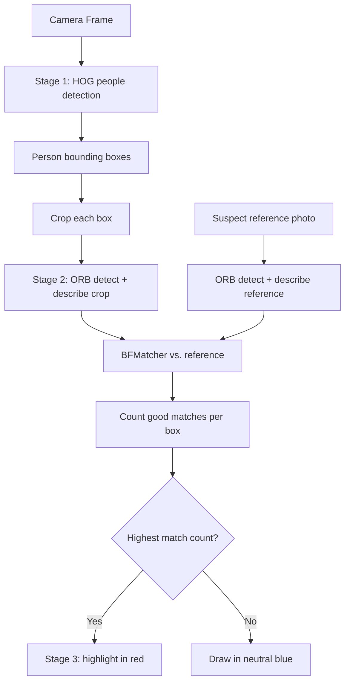

# OpenCV Basics for Robotics — Unit 6: Course Project

The premise: a dangerous person is somewhere in the crowd near your robot, and several other people are also present as decoys. Your job is to detect every person in the scene and pick out the one that matches a known reference image of the suspect. This unit ties together people detection (Unit 3) and feature matching (Unit 4) into a single pipeline.

The flowchart below shows the full three-stage pipeline this unit builds, from raw frame to a highlighted suspect.



## Framing the problem
Break it into two clearly separable stages so you can test each independently:
1. **Who is in the scene?** Use HOG people detection (Unit 3) to get a bounding box for every person visible to the robot's camera.
2. **Which one is the suspect?** For each detected person's bounding box, crop that region and compare it against a reference photo of the suspect using ORB feature matching (Unit 4). The crop with the strongest match wins.

Keeping detection and identification as separate stages matters: if you conflate them, a bug in matching looks identical to a bug in detection, and you'll waste time debugging the wrong half.

## Stage 1 — detect all people
```python
hog = cv2.HOGDescriptor()
hog.setSVMDetector(cv2.HOGDescriptor_getDefaultPeopleDetector())
boxes, weights = hog.detectMultiScale(frame, winStride=(8, 8), scale=1.05)
```
Keep only boxes above a confidence threshold on `weights` to cut down false positives before spending matching effort on them.

## Stage 2 — match each crop against the suspect
```python
orb = cv2.ORB_create(nfeatures=500)
kp_ref, des_ref = orb.detectAndCompute(suspect_gray, None)
bf = cv2.BFMatcher(cv2.NORM_HAMMING, crossCheck=True)

best_score, best_box = -1, None
for (x, y, w, h) in boxes:
    crop = gray_frame[y:y+h, x:x+w]
    kp, des = orb.detectAndCompute(crop, None)
    if des is None:
        continue
    matches = bf.match(des_ref, des)
    good = [m for m in matches if m.distance < 40]
    if len(good) > best_score:
        best_score, best_box = len(good), (x, y, w, h)
```
Counting "good" matches below a distance threshold, rather than trusting the single best match, makes the score more robust to a single lucky/unlucky pairing.

## Stage 3 — highlight the result
Draw every detected person in a neutral color (say, blue), and the highest-scoring match in red, with the match count overlaid as text so you can sanity-check the decision at a glance:

```python
for (x, y, w, h) in boxes:
    color = (0, 0, 255) if (x, y, w, h) == best_box else (255, 0, 0)
    cv2.rectangle(frame, (x, y), (x + w, y + h), color, 2)
cv2.putText(frame, f'matches: {best_score}', (best_box[0], best_box[1] - 10),
            cv2.FONT_HERSHEY_SIMPLEX, 0.6, (0, 0, 255), 2)
```

## Where this falls short (and why that's expected)
ORB matching on low-resolution, motion-blurred crops from a distant camera is genuinely hard — expect false positives, especially with few extractable keypoints on small crops. That's realistic: this project deliberately mirrors the actual limitation of classical (non-deep-learning) person re-identification, and it's the reason production systems layer additional signals (clothing color histograms, gait, deep re-ID embeddings) on top of exactly this kind of pipeline rather than relying on ORB alone.

## Try it yourself
Assemble the full pipeline against a folder of test images: one "suspect" reference photo and 3-4 group photos where that person appears among others. Run detection + matching on each group photo and report precision informally (did it pick the right box?). Then try weakening the reference photo (smaller crop, different lighting) and observe how the match count for the correct person drops — this is the practical trade-off between reference photo quality and detection reliability that any deployed system has to manage.
