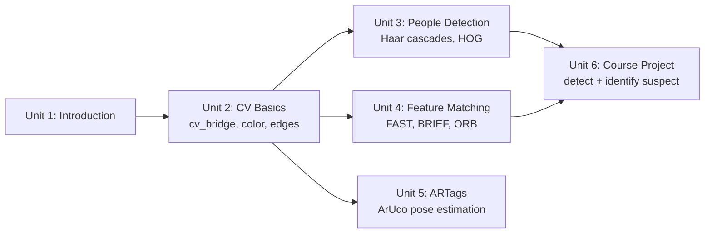

# OpenCV Basics for Robotics

This course covers the classical computer-vision toolkit that robots have relied on for cameras long before deep learning became standard: converting ROS images into OpenCV data, filtering by color and detecting edges, recognizing people via Haar cascades and HOG, matching distinctive image features with FAST/BRIEF/ORB, and reading precise 6-DOF poses from ArUco fiducial markers. It ends with a combined project that chains people detection and feature matching together to pick a specific person out of a crowd — the same pattern used, in more sophisticated form, throughout real robot perception pipelines.

The diagram below shows how each unit's skills build on the ones before it, culminating in the combined Course Project.

1. [Introduction to the Course](01-introduction-to-the-course.md) — Unit for previewing the contents of the Course.
2. [Computer Vision Basics](02-computer-vision-basics.md) — cv_bridge, color spaces and color filtering, edge detection, and a brief introduction to convolutions/morphological transformations.
3. [People-related OpenCV functions](03-people-related-opencv-functions.md) — Face Detection (Haar cascades) and People Detection and Tracking (HOG).
4. [Feature Matching](04-feature-matching.md) — Features from Accelerated Segment Test (FAST), Binary Robust Independent Elementary Features (BRIEF) and Oriented FAST and Rotated BRIEF (ORB).
5. [ARTags (Augmented Reality)](05-artags-augmented-reality.md) — Learn how to use ARtags (Augmented Reality) in robotics.
6. [Course Project](06-course-project.md) — There is a dangerous person in this city, and many possible suspects are close to your robot. You must detect all the people and highlight the dangerous person.
