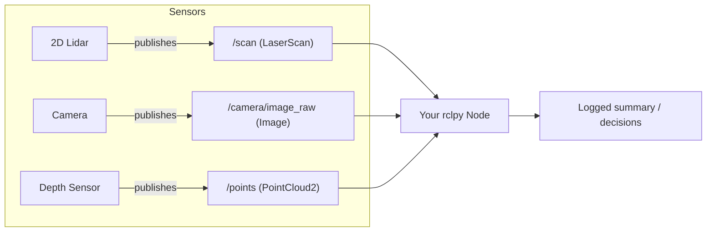

# ROS 2 Perception in 5 Days — Unit 2: Working With Sensor Data in ROS 2

Every perception technique in this course starts from one of three message types. This unit teaches you to read and reason about `LaserScan`, `Image`, and `PointCloud2` messages directly, before any OpenCV or PCL processing gets layered on top.

The diagram below shows how each sensor driver publishes its own message type onto a topic that your node subscribes to.



## Sensor integration in ROS 2
A sensor driver node's only job is to wrap hardware (or a simulated equivalent) and publish standardized messages on a topic — this is what lets a line-follower node written against `sensor_msgs/Image` work unmodified whether the camera is a real USB webcam or a Gazebo camera plugin. Discovering what a running robot publishes is the first skill worth building:

```bash
ros2 topic list
ros2 topic info /scan
ros2 topic hz /camera/image_raw
ros2 interface show sensor_msgs/msg/LaserScan
```

`ros2 interface show` is worth memorizing — it prints the exact field layout of any message type without you needing to open source code.

## Understanding Laser Scan messages
`sensor_msgs/LaserScan` represents a single sweep of a 2D range sensor as an array of distances. The key fields are `angle_min`, `angle_max`, `angle_increment` (which together define the angle of every sample), and `ranges` (the distance readings themselves, with `range_min`/`range_max` marking valid bounds — a reading outside that range, or `inf`/`NaN`, means "no return").

```python
import rclpy
from rclpy.node import Node
from sensor_msgs.msg import LaserScan

class ScanListener(Node):
    def __init__(self):
        super().__init__('scan_listener')
        self.create_subscription(LaserScan, '/scan', self.on_scan, 10)

    def on_scan(self, msg: LaserScan):
        closest = min(r for r in msg.ranges if msg.range_min < r < msg.range_max)
        self.get_logger().info(f'Closest obstacle: {closest:.2f} m')
```

### Hands-on: Laser messages
Run the node above (or `ros2 topic echo /scan --field ranges`) against a simulated robot and confirm the reported closest distance drops as you drive the robot toward a wall.

## Understanding Image messages
`sensor_msgs/Image` carries raw pixel data plus metadata: `height`, `width`, `encoding` (e.g. `bgr8`, `rgb8`, `mono8` — this tells you how to interpret the bytes), `step` (bytes per row, which can exceed `width * channels` due to padding), and the flat `data` byte array itself. You will almost never touch `data` directly — Unit 3 introduces `cv_bridge`, which converts this message into an OpenCV-friendly array for you. For now, it's enough to recognize the shape of the message:

```bash
ros2 topic echo /camera/image_raw --field encoding
ros2 topic echo /camera/image_raw --field height
```

### Hands-on: Image messages
Subscribe to an image topic in a small `rclpy` node, log `msg.encoding`, `msg.width`, and `msg.height` on the first message received, and confirm they match what you'd expect from your camera or simulated camera's configuration.

## Understanding Point Cloud messages
`sensor_msgs/PointCloud2` is the densest of the three: instead of a flat array of numbers, each point is a small binary record described by a `fields` array (each field has a `name` like `x`, `y`, `z`, or `rgb`, an `offset`, and a `datatype`). Reading a cloud means iterating through `data` in `point_step`-sized chunks and unpacking each field's bytes — which is exactly what the `sensor_msgs_py.point_cloud2` helper does for you:

```python
from sensor_msgs_py import point_cloud2

def on_cloud(self, msg):
    points = point_cloud2.read_points(msg, field_names=('x', 'y', 'z'), skip_nans=True)
    count = sum(1 for _ in points)
    self.get_logger().info(f'{count} valid points in this cloud')
```

### Hands-on: Point Cloud messages
Point a depth camera or simulated RGB-D sensor's `/points` (or similarly named) topic at this snippet and confirm the point count changes sensibly as objects move in and out of the sensor's field of view.

## Conclusions
You now know the three message types every later unit builds on, and — more importantly — the habit of using `ros2 interface show` and `ros2 topic echo` to inspect any unfamiliar message before writing code against it.

## Try it yourself
Write a single node that subscribes to all three topics (`/scan`, an image topic, and a point cloud topic) and logs one summary line per message type, throttled to once per second per topic using `self.get_logger().info(..., throttle_duration_sec=1.0)`. This "sensor dashboard" node is a useful debugging habit to carry into every later unit.
