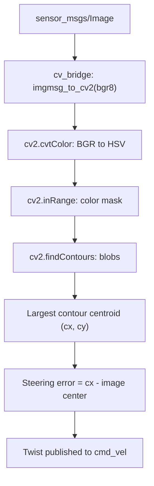

# ROS 2 Perception in 5 Days — Unit 3: Image Processing

This is where sensor messages turn into decisions. You'll bridge ROS 2 images into OpenCV, isolate objects by color, and use that to build two working robot behaviors: a blob tracker and a line follower.

The pipeline below traces a raw camera frame through cv_bridge, HSV thresholding, and blob-centroid extraction to the final steering command.



## OpenCV and cv_bridge
OpenCV (`docs.opencv.org`) is a general-purpose computer vision library — it has no idea what a ROS 2 topic is. `cv_bridge` is the small translation layer that converts between `sensor_msgs/Image` and OpenCV's native array representation (a NumPy array in Python, `cv::Mat` in C++), in both directions.

```python
from cv_bridge import CvBridge
import cv2

class ImageProcessor(Node):
    def __init__(self):
        super().__init__('image_processor')
        self.bridge = CvBridge()
        self.create_subscription(Image, '/camera/image_raw', self.on_image, 10)

    def on_image(self, msg):
        frame = self.bridge.imgmsg_to_cv2(msg, desired_encoding='bgr8')
        cv2.imshow('camera', frame)
        cv2.waitKey(1)
```

`desired_encoding='bgr8'` is doing real work: it tells `cv_bridge` to convert into the specific byte layout OpenCV's functions expect, regardless of what encoding the camera actually published in.

## Intro to color spaces
BGR (or RGB) encodes color as red/green/blue intensity, which is intuitive for storage but poor for isolating a color — a red object under different lighting has wildly different BGR values. HSV (Hue, Saturation, Value) separates *what color* (hue) from *how vivid* and *how bright*, which makes "find everything red" a simple range check on one channel:

```python
hsv = cv2.cvtColor(frame, cv2.COLOR_BGR2HSV)
lower_red = (0, 120, 70)
upper_red = (10, 255, 255)
mask = cv2.inRange(hsv, lower_red, upper_red)
```

## Blob tracking
"Blob tracking" means taking a binary mask (like the one above) and finding the connected regions of foreground pixels — the blobs — then picking out one to track, usually by area or position. `cv2.findContours` plus image moments gets you a blob's centroid:

```python
contours, _ = cv2.findContours(mask, cv2.RETR_EXTERNAL, cv2.CHAIN_APPROX_SIMPLE)
if contours:
    largest = max(contours, key=cv2.contourArea)
    M = cv2.moments(largest)
    if M['m00'] > 0:
        cx, cy = int(M['m10'] / M['m00']), int(M['m01'] / M['m00'])
```

### Create and test a Blob Tracker node
Wrap the mask + contour + centroid logic above into a node that subscribes to the camera topic and publishes the centroid (e.g. as a `geometry_msgs/Point`, normalized to image width so it's resolution-independent). Launch it alongside a camera source and move a colored object through the frame — confirm the published centroid tracks it.

## Line following
A line follower is a blob tracker with a control loop bolted on: instead of just reporting the centroid, you steer toward it. The classic approach crops the frame to a horizontal band near the bottom (so you're only reacting to the line right in front of the robot), thresholds for the line's color, computes the centroid `cx` of that band, and turns proportionally to how far `cx` is from the image center:

```python
error = cx - (frame.shape[1] // 2)
twist = Twist()
twist.linear.x = 0.15
twist.angular.z = -float(error) / 200.0
cmd_vel_pub.publish(twist)
```

**Optimizing for multiple lines**: when more than one line/path is visible (a fork or intersection), a single centroid over the whole band gets confused — it may average between two paths and steer into neither. The fix is to first find *all* contours in the band, and choose the one whose centroid is closest to the robot's current heading (or closest to the previous frame's chosen centroid), rather than blindly taking the single largest blob.

**Going toward an entrance/exit door**: once your robot can follow a line reliably, the same centroid-following idea generalizes to steering toward any detected target — for a door, that means detecting the door's marker or frame (e.g. by color or shape) and using its centroid as the steering target instead of a line's, switching behaviors once the line ends.

### Test the Line Follower, the optimized version, and the Door Follower
Run each behavior against a track: a single line, a track with a branch, and a track ending at a doorway. Confirm the robot follows correctly in each case and that the optimized version specifically avoids drifting off at the fork.

## Try it yourself
Extend the blob tracker into a minimal line follower: threshold a bottom strip of the frame for a known line color, compute the centroid, and publish a `Twist` that turns the robot toward it. Test it on a straight line first, then a gentle curve, before attempting a fork.
