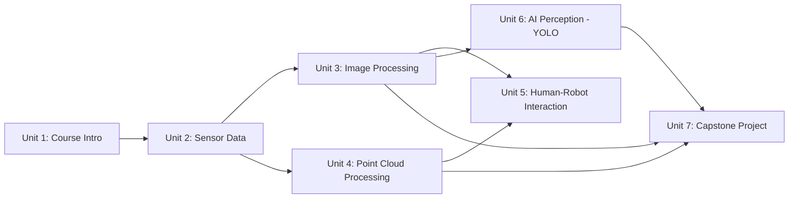

# ROS 2 Perception in 5 Days

This course builds a complete robot perception stack in ROS 2, moving from raw sensor messages to full deep-learning-based understanding of a scene. You'll learn to read `LaserScan`, `Image`, and `PointCloud2` data directly; process images with OpenCV via `cv_bridge` to build a working line follower; process 3D point clouds with PCL to segment surfaces and cluster objects; apply those techniques specifically to people through face detection, recognition, and tracking; bring in a modern deep-learning detector (YOLO) for object detection, pose estimation, and segmentation; and finally combine everything into a capstone inventory-management robot.

The diagram below shows how each unit's skills feed into later ones, culminating in the Unit 7 capstone.

1. [Course Intro](01-course-intro.md) — Get a glimpse of what this course on ROS 2 Perception in 5 Days is all about.
2. [Working With Sensor Data in ROS 2](02-working-with-sensor-data-in-ros-2.md) — Understand the different sensor data types used in ROS 2.
3. [Image Processing](03-image-processing.md) — Provide a comprehensive understanding of image processing in ROS 2, focusing on integrating OpenCV for implementing essential perception techniques.
4. [Point Cloud Processing](04-point-cloud-processing.md) — Thorough grasp of point cloud processing within ROS 2, covering two main workflows: Surface and Object Detection.
5. [Human-Robot Interaction](05-human-robot-interaction.md) — A structured approach to implementing perception techniques for enhancing human-robot interaction, from face detection and recognition to pose estimation and people tracking.
6. [AI Perception Techniques](06-ai-perception-techniques.md) — Advanced perception techniques in robotics using AI methods such as YOLO, for object detection, pose estimation, and instance segmentation.
7. [Project: Intelligent Inventory Management with ROS 2](07-project-intelligent-inventory-management-with-ros-2.md) — The capstone project, bringing together all prior units to solve a real-world inventory management problem.
