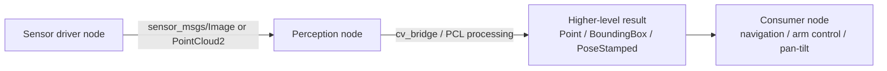

# ROS Perception in 5 Days — Unit 1: Perception with ROS Intro

This unit sets the map for the whole course: what "perception" means for a robot, which ROS building blocks carry image and point cloud data, and how the eight projects ahead (blob tracking through the hexapod capstone) fit together as one growing skill set.

The diagram below shows the publish-subscribe shape every perception node in this course follows: a sensor driver publishes raw data, a perception node converts and processes it, and the result feeds a downstream consumer.



## What perception means for a robot
A robot's perception stack turns raw sensor signal — pixels, depth values, laser ranges — into structured information it can act on: "there is a red ball at this pixel," "a face is present," "the table surface is here." Perception sits between raw sensor drivers and the decision-making/control stack. In this course everything is built on ROS 1 (Noetic), so nodes communicate over topics and services, and each project you build follows the same shape: a sensor driver node publishes data, a perception node subscribes, processes it, and republishes a higher-level result (a `Point`, a bounding box, a `PoseStamped`) that another node (navigation, arm control, a servo pan-tilt) consumes.

## The sensor topics you'll rely on
Almost every unit touches one of these topic families:
- `sensor_msgs/Image` on topics like `/camera/rgb/image_raw` — raw color frames, consumed via `cv_bridge` to get an OpenCV `numpy` array.
- `sensor_msgs/PointCloud2` on topics like `/camera/depth/points` — 3D points with optional color, used from Unit 4 onward for surface/object recognition.
- `sensor_msgs/CameraInfo` — intrinsics needed whenever you convert a 2D pixel into a 3D ray.

Check what a simulated or real robot actually exposes before writing any code:
```bash
rostopic list | grep -E "image|points|camera_info"
rostopic hz /camera/rgb/image_raw
rostopic echo -n1 /camera/rgb/camera_info
```

## cv_bridge: the seam between ROS and OpenCV
`cv_bridge` converts `sensor_msgs/Image` messages to and from OpenCV's `numpy` arrays. Every vision unit in this course starts with this pattern:
```python
import rospy
from sensor_msgs.msg import Image
from cv_bridge import CvBridge, CvBridgeError

class PerceptionNode:
    def __init__(self):
        self.bridge = CvBridge()
        rospy.Subscriber("/camera/rgb/image_raw", Image, self.on_image)

    def on_image(self, msg):
        try:
            frame = self.bridge.imgmsg_to_cv2(msg, desired_encoding="bgr8")
        except CvBridgeError as e:
            rospy.logwarn(e)
            return
        # frame is now a standard OpenCV BGR image
```
Every downstream unit (blob tracking, line following, face detection) reuses this exact subscribe-convert-process loop; only what happens after `on_image` changes.

## How the course is structured
Units 2-3 build core 2D vision skills (color and edge-based tracking) on a moving robot. Unit 4 introduces 3D point clouds and surface/object segmentation. Units 5-8 layer increasingly capable recognition on top: deep-learning object detection (YOLO), face detection, face recognition, and person tracking. Unit 9 is a capstone that combines several of these skills on a PhantomX hexapod. Each unit assumes you can already program — the focus is the perception concepts and the ROS/OpenCV/PCL glue code, not general Python.

## Try it yourself
Bring up any camera source available to you (a real webcam via `usb_cam`, a simulated camera in Gazebo, or a bag file played with `rosbag play`). Write a 15-line node using the `cv_bridge` pattern above that subscribes to the image topic and logs the frame's width, height, and mean pixel brightness once per second (throttle logging with `rospy.loginfo_throttle`). Confirm it runs with `rosrun <your_pkg> <your_node.py>` before moving to Unit 2.
