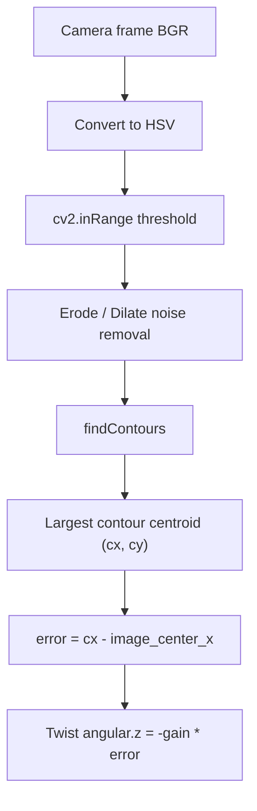

# ROS Perception in 5 Days — Unit 2: Vision Basics Blob Tracking

Color blob tracking is the simplest useful perception pipeline you can build, and it teaches the two ideas every later unit reuses: isolating a region of interest with thresholding, and turning a pixel location into a decision your robot can act on.

The diagram below traces the blob-tracking pipeline from a raw frame to the proportional-control command that keeps the blob centered.



## Why HSV instead of RGB
RGB mixes color and brightness together, so the same red ball looks like a different RGB triple under different lighting. HSV (Hue, Saturation, Value) separates color (Hue) from brightness (Value), which makes thresholding far more robust to lighting changes. OpenCV's `cvtColor` converts between spaces:
```python
import cv2
hsv = cv2.cvtColor(frame, cv2.COLOR_BGR2HSV)
```
Hue in OpenCV runs 0-179 (not 0-359), which trips people up the first time — halve any hue value you look up from a standard color wheel.

## Thresholding and masking
`cv2.inRange` builds a binary mask of pixels within a color range:
```python
lower_red = (0, 120, 70)
upper_red = (10, 255, 255)
mask = cv2.inRange(hsv, lower_red, upper_red)
mask = cv2.erode(mask, None, iterations=2)
mask = cv2.dilate(mask, None, iterations=2)
```
The erode/dilate pair (an "opening") removes small noise specks before you try to find the blob itself — skipping it is the most common reason blob tracking looks jittery.

## Finding the blob and its centroid
`cv2.findContours` extracts connected white regions from the mask; you then keep the largest one and compute its centroid with image moments:
```python
contours, _ = cv2.findContours(mask, cv2.RETR_EXTERNAL, cv2.CHAIN_APPROX_SIMPLE)
if contours:
    c = max(contours, key=cv2.contourArea)
    if cv2.contourArea(c) > 300:  # ignore tiny noise blobs
        M = cv2.moments(c)
        cx = int(M["m10"] / M["m00"])
        cy = int(M["m01"] / M["m00"])
```
`(cx, cy)` is your tracked point in pixel coordinates — this is the same centroid-extraction pattern Unit 6 reuses for face bounding boxes.

## Turning pixels into robot motion
A perception result is only useful once it drives a decision. A minimal proportional controller that keeps the blob centered by rotating the robot:
```python
from geometry_msgs.msg import Twist

image_center_x = frame.shape[1] / 2
error = cx - image_center_x
twist = Twist()
twist.angular.z = -0.003 * error  # negative: turn toward the blob
cmd_pub.publish(twist)
```
This proportional (P-only) control loop — error times a gain, published as a `Twist` — is the same shape you'll use for line following in Unit 3 and face tracking in Unit 6.

## Try it yourself
Pick a brightly colored object, sample its HSV range using a small OpenCV trackbar tool (`cv2.createTrackbar` on H/S/V min and max), then write a node that publishes `cmd_vel` to keep the object centered horizontally in the frame. Test it by slowly moving the object left and right in front of the camera and confirming the robot (real or simulated) rotates to follow it.
