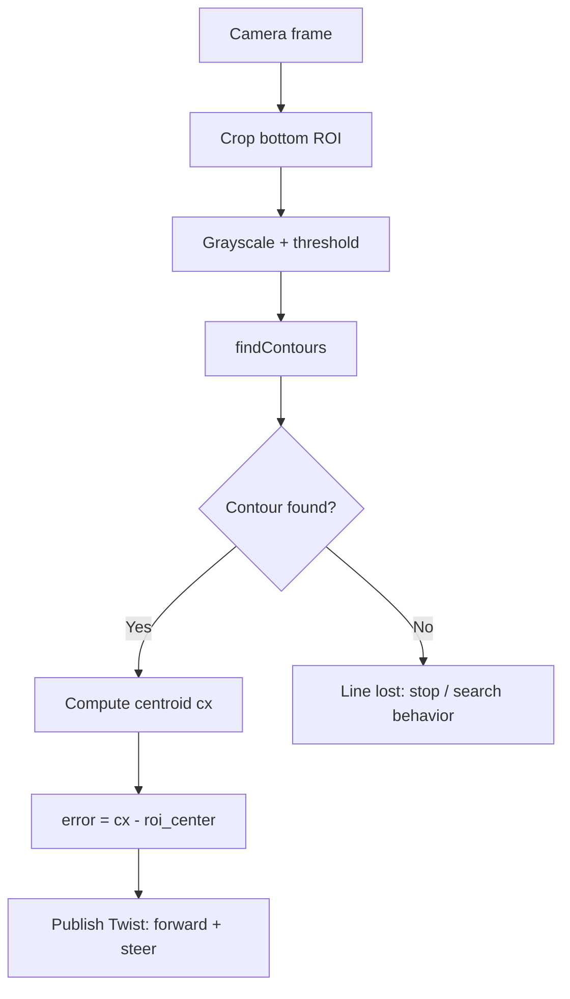

# ROS Perception in 5 Days — Unit 3: Vision Basics Follow Line

Line following extends the centroid-tracking idea from Unit 2 to a shape rather than a color blob, and introduces a technique — cropping a region of interest before processing — that keeps every later vision pipeline in this course fast enough to run in real time.

The diagram below shows the ROI-crop-threshold-centroid-steer pipeline, including the explicit branch for when the line disappears from frame.



## Region of interest: only look where the line can be
Processing an entire 640x480 frame to find a floor line wastes cycles on sky, walls, and clutter that will never contain the line. Crop a horizontal strip near the bottom of the frame, where the line is closest to the robot and steering decisions matter most:
```python
height, width, _ = frame.shape
roi = frame[int(height * 0.75):height, 0:width]
```
Every subsequent step (thresholding, contour finding) runs on this much smaller `roi`, which is both faster and less prone to false positives from background objects.

## Isolating the line
A floor line is usually a strong contrast against the floor, so a simple approach is grayscale plus a binary threshold rather than full HSV color matching:
```python
gray = cv2.cvtColor(roi, cv2.COLOR_BGR2GRAY)
_, thresh = cv2.threshold(gray, 60, 255, cv2.THRESH_BINARY_INV)
```
`THRESH_BINARY_INV` makes dark line pixels become white in the mask (assuming a dark line on a light floor) — invert the logic if your line is light-on-dark. If the line has a distinct color instead of just contrast, reuse the `inRange` HSV approach from Unit 2 on the ROI instead of grayscale thresholding.

## Steering from the line's centroid
Exactly as in Unit 2, find the largest contour in the ROI and compute its centroid — but here the horizontal offset from center becomes a steering error rather than a rotation-in-place error:
```python
contours, _ = cv2.findContours(thresh, cv2.RETR_EXTERNAL, cv2.CHAIN_APPROX_SIMPLE)
if contours:
    c = max(contours, key=cv2.contourArea)
    M = cv2.moments(c)
    cx = int(M["m10"] / M["m00"]) if M["m00"] else roi.shape[1] // 2
    error = cx - (roi.shape[1] // 2)

    twist = Twist()
    twist.linear.x = 0.15
    twist.angular.z = -0.005 * error
    cmd_pub.publish(twist)
else:
    # line lost: stop or execute a search behavior rather than drive blind
    cmd_pub.publish(Twist())
```

## Handling the "line lost" case
Unlike a static blob, a line can disappear from frame entirely at sharp turns or gaps. Always define explicit behavior for the no-contour case — stopping is safest for learning, but a more robust robot remembers the last known error direction and turns that way to reacquire the line. This "what happens when perception has no answer" question reappears in every later unit (face tracking, person tracking) and is worth deciding deliberately each time rather than leaving undefined.

## Try it yourself
Build a simple track (tape on a floor, or a line texture in simulation) with at least one curve. Implement the ROI-crop-threshold-centroid-steer pipeline above and tune the linear/angular gains until the robot completes a lap without losing the line. Then deliberately break the line with a 10cm gap and verify your "line lost" behavior triggers instead of the robot driving off course.
