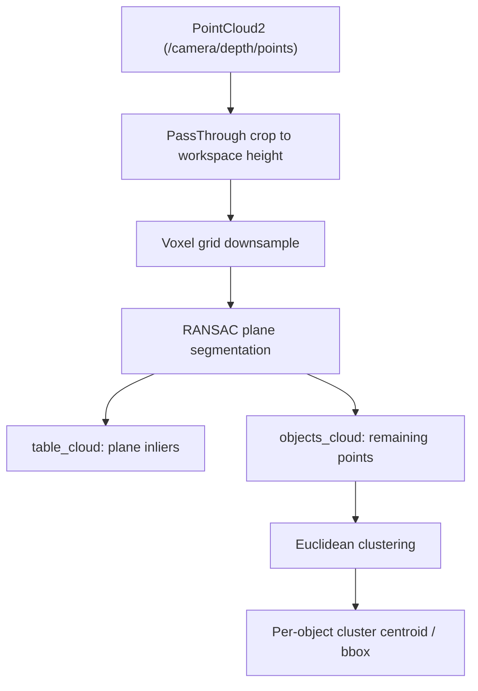

# ROS Perception in 5 Days — Unit 4: Surface and Object Recognition

This unit moves perception from 2D pixels into 3D space using point clouds — the data type that lets a robot know not just what something looks like, but where it physically is, which is essential before an arm can pick anything up. Units 1-3 answered "where is this in the image"; this unit answers "where is this in the world."

The diagram below shows how a raw point cloud is cropped to the region that matters, downsampled, split into the dominant surface plane and everything above it, then clustered into individual object candidates.



## From image to point cloud
A depth-capable camera (e.g. RGB-D) publishes `sensor_msgs/PointCloud2` on a topic such as `/camera/depth/points`. Each point carries `x, y, z` (in meters, relative to the camera's optical frame) and often `rgb`. The `frame_id` matters as much as the coordinates: clustering and grasp planning are only meaningful once you know which frame those meters live in, so keep `tf`/`tf2` in mind even here. The PCL-backed tooling shipped alongside ROS 1 (`python-pcl`, or `pcl_ros` nodelets) lets you filter, segment, and cluster this data:
```python
import rospy
from sensor_msgs.msg import PointCloud2
import sensor_msgs.point_cloud2 as pc2

def on_cloud(msg):
    points = list(pc2.read_points(msg, field_names=("x", "y", "z"), skip_nans=True))
```
Raw clouds are large (hundreds of thousands of points), most of which is irrelevant to the task, so crop and downsample before doing anything else. A `PassThrough` filter drops points outside a height range (e.g. the floor and anything beyond the table), and a voxel grid filter then collapses the rest to one representative point per small cube of space — the point-cloud equivalent of downsampling an image:
```python
passthrough = cloud.make_passthrough_filter()
passthrough.set_filter_field_name("z")
passthrough.set_filter_limits(0.0, 1.2)  # keep points within 1.2m of the camera
cloud = passthrough.filter()

sor = cloud.make_voxel_grid_filter()
sor.set_leaf_size(0.01, 0.01, 0.01)  # 1cm cubes
cloud = sor.filter()
```
A smaller leaf size keeps more detail but costs more compute; 1cm is a reasonable start for tabletop-scale objects.

## Finding flat surfaces with RANSAC plane segmentation
A table, floor, or shelf appears in a point cloud as a large flat cluster of points. RANSAC (Random Sample Consensus) plane fitting repeatedly picks random point triples, fits a plane, and keeps the plane with the most inlier points within a distance tolerance — robust to noisy sensor data because outliers simply fail to vote for the winning plane, rather than dragging a least-squares fit off target:
```python
import pcl

cloud = pcl.PointCloud()
cloud.from_list(points)

seg = cloud.make_segmenter()
seg.set_model_type(pcl.SACMODEL_PLANE)
seg.set_method_type(pcl.SAC_RANSAC)
seg.set_distance_threshold(0.01)
inliers, coefficients = seg.segment()

table_cloud = cloud.extract(inliers, negative=False)
objects_cloud = cloud.extract(inliers, negative=True)
```
`table_cloud` is the surface itself; `objects_cloud` is everything left over — exactly where the objects sitting on that surface live. `set_distance_threshold` controls how far a point can sit from the fitted plane and still count as "on" it: too small splits a real table into many small clusters instead of one; too large absorbs short objects into the table itself. If the scene has more than one large flat surface (a table in front of a floor), RANSAC returns whichever has more inliers, not necessarily the one you want — the `PassThrough` crop above is usually the fix, or check that `coefficients`' plane normal is roughly vertical to confirm it's horizontal and not a wall.

## Clustering the remaining points into objects
Once the dominant plane is removed, Euclidean clustering groups the remaining points by proximity, separating individual objects from each other:
```python
tree = objects_cloud.make_kdtree()
ec = objects_cloud.make_EuclideanClusterExtraction()
ec.set_ClusterTolerance(0.02)
ec.set_MinClusterSize(50)
ec.set_MaxClusterSize(25000)
ec.set_SearchMethod(tree)
cluster_indices = ec.Extract()
```
The KD-tree exists so the algorithm doesn't check every point against every other point when deciding what's "nearby." `ClusterTolerance` sets how close two points must be (2cm here) to count as one object: too tight splits a single mug into several clusters, too loose merges two nearby objects into one. `MinClusterSize`/`MaxClusterSize` filter out clusters too small to be real (sensor noise) or too large to be one graspable item.

Each entry in `cluster_indices` is one candidate object. A cluster of points isn't directly useful to a manipulation stack, though — it needs a single pose and size, so average the cluster's points for the centroid and take the min/max along each axis for an axis-aligned bounding box, the same way you'd wrap up a 2D contour, just in 3D:
```python
import numpy as np

cluster_points = np.array([objects_cloud[i] for i in cluster_indices[0]])
centroid = cluster_points.mean(axis=0)
min_bound, max_bound = cluster_points.min(axis=0), cluster_points.max(axis=0)
```
That's enough for a pick-and-place node to decide an approach height and gripper width without ever knowing what the object actually is — the same "publish a clean result, let downstream nodes stay ignorant of the pipeline" handoff from earlier units, applied to 3D geometry instead of 2D pixels.

## Try it yourself
Using a depth camera (real or simulated) pointed at a table with two or three objects on it, write a node that crops and downsamples the cloud, segments the table plane, clusters the remaining points, and publishes the centroid of each cluster as a `geometry_msgs/PointStamped`. Verify in RViz that you get one marker per object and that adding or removing an object changes the cluster count. As a stretch goal, push two objects close together until they merge into one cluster, then retune `ClusterTolerance` until they separate correctly again.
