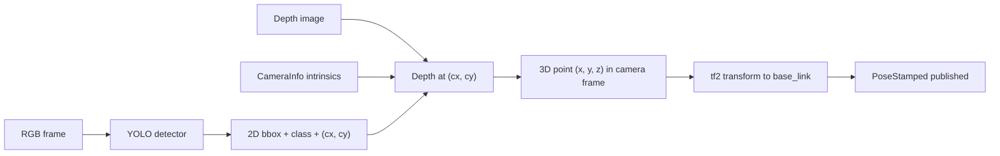

# ROS Perception in 5 Days — Unit 5: Yolo 3D object location

Where Unit 4 found objects purely from 3D geometry, this unit adds category recognition: YOLO tells you *what* an object is from a single RGB frame, and this unit shows how to fuse that 2D detection with depth data so the robot also knows *where* the object is in 3D.

The diagram below shows how a 2D YOLO detection is fused with depth and camera intrinsics to produce a 3D pose in the robot's frame.



## Why a detector instead of thresholding
Color/shape thresholding (Units 2-3) breaks down the moment you need to recognize dozens of object categories under varying lighting and backgrounds. YOLO ("You Only Look Once") is a single-pass convolutional network that predicts bounding boxes and class labels for an entire image at once, fast enough to run per-frame on a robot. You don't need to train YOLO from scratch for this course — pretrained weights on common object datasets (e.g. COCO) already recognize dozens of everyday categories, which is enough to practice the ROS integration pattern.

## Running YOLO inside a ROS node
The integration shape is the same subscribe/convert/process/publish loop from Unit 1, with a detector call replacing the OpenCV thresholding step:
```python
results = model(frame)  # frame from cv_bridge, as in earlier units
for box in results.boxes:
    x1, y1, x2, y2 = box.xyxy[0]
    class_id = int(box.cls[0])
    confidence = float(box.conf[0])
    if confidence > 0.5:
        cx, cy = int((x1 + x2) / 2), int((y1 + y2) / 2)
        # cx, cy is the 2D detection center — next step: lift it to 3D
```
Publish detections as a custom or `vision_msgs/Detection2D` message so downstream nodes don't need to know anything about YOLO internals.

## Lifting a 2D detection into 3D
A bounding box center is a pixel — to get a 3D position you need the depth at that pixel and the camera's intrinsics (from `sensor_msgs/CameraInfo`). If you have a registered depth image aligned to the RGB frame, look up the depth directly:
```python
depth = depth_image[cy, cx]  # in meters
fx, fy = camera_info.K[0], camera_info.K[4]
ppx, ppy = camera_info.K[2], camera_info.K[5]

x = (cx - ppx) * depth / fx
y = (cy - ppy) * depth / fy
z = depth
```
This is the pinhole camera model run backward: instead of projecting a 3D point onto the image plane, you're reconstructing the 3D ray for a known pixel and known depth. `(x, y, z)` is in the camera's optical frame — use `tf`/`tf2` to transform it into a robot-centric frame (e.g. `base_link`) before acting on it.

## Publishing a usable result
Wrap the class label, confidence, and 3D position into a `PoseStamped` (or a custom detection message) and publish once per detected object, so the navigation or manipulation stack can subscribe without caring about YOLO or depth math at all — the same "publish a clean, higher-level result" principle from Unit 1 applies here too.

## Try it yourself
Point a depth camera at two different everyday objects that YOLO's pretrained classes recognize (e.g. a bottle and a chair). Write a node that detects both, computes each one's 3D position using the pinhole back-projection above, and publishes a `PoseArray` with one pose per object. Visualize the result in RViz and confirm the positions roughly match where the objects actually are relative to the camera.
