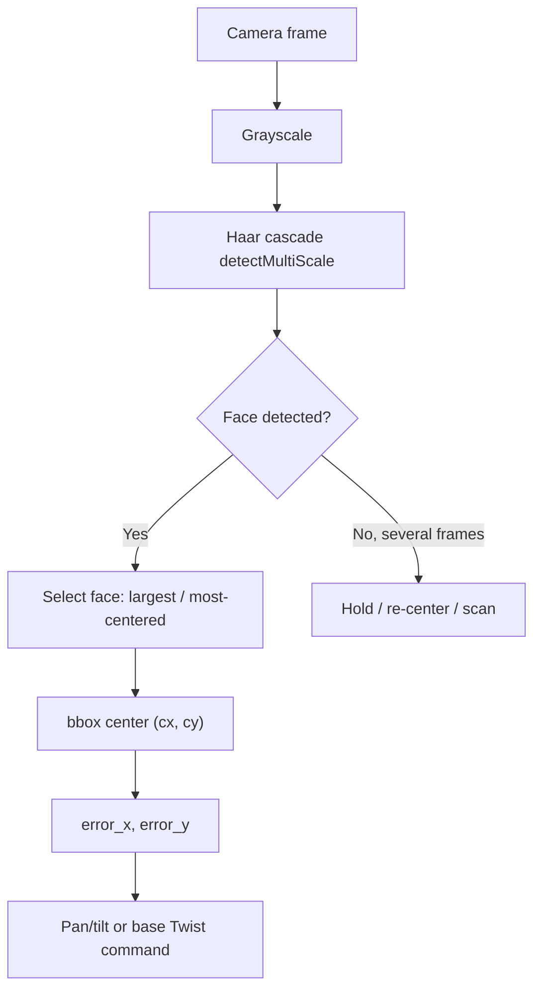

# ROS Perception in 5 Days — Unit 6: Face Detection and tracking

Faces are a specialized case of object detection: fast, well-supported detectors exist, and turning a detected face into a servo/base motion that keeps it centered is a direct rerun of the P-controller idea from Units 2-3, now aimed at people instead of colored balls.

The diagram below shows the Haar-cascade detection pipeline feeding a two-axis pan/tilt controller, including the explicit branch for when no face is found.



## Detecting faces with Haar cascades
OpenCV ships pretrained Haar cascade classifiers that are lightweight enough to run in real time on modest hardware — a good default before reaching for a heavier deep-learning face detector:
```python
face_cascade = cv2.CascadeClassifier(cv2.data.haarcascades + "haarcascade_frontalface_default.xml")

gray = cv2.cvtColor(frame, cv2.COLOR_BGR2GRAY)
faces = face_cascade.detectMultiScale(gray, scaleFactor=1.1, minNeighbors=5, minSize=(30, 30))
for (x, y, w, h) in faces:
    cv2.rectangle(frame, (x, y), (x + w, y + h), (0, 255, 0), 2)
```
`scaleFactor` controls how much the image is shrunk at each scale step (smaller = more thorough but slower); `minNeighbors` filters out false positives by requiring multiple overlapping detections before accepting a face.

## From detection to a tracked point
Exactly as with the color blob in Unit 2, you reduce each detected face to a single trackable point — its bounding box center:
```python
if len(faces) > 0:
    x, y, w, h = faces[0]  # or pick the largest face if several are detected
    cx, cy = x + w // 2, y + h // 2
```
When multiple faces are detected, decide a selection policy up front: largest box (closest person), most-centered box, or the first one that matches a known identity (which Unit 7 makes possible).

## Tracking with a pan-tilt or base rotation
Reuse the proportional controller pattern from Units 2-3, but now you likely have two axes (pan and tilt) instead of one:
```python
error_x = cx - frame.shape[1] / 2
error_y = cy - frame.shape[0] / 2

pan_cmd = -0.005 * error_x
tilt_cmd = -0.005 * error_y
```
If your platform has a pan-tilt unit, publish these as joint position/velocity commands; if it's a mobile base without a neck, fold `error_x` into `angular.z` on a `Twist` as in Unit 2.

## Detection loss and re-acquisition
Faces disappear from frame more often than a fixed-color blob — people turn away, walk behind obstacles, or step out of frame. Reuse the "line lost" discipline from Unit 3: define what the robot does when `len(faces) == 0` for several consecutive frames (hold last position briefly, then re-center or scan) rather than leaving that branch unhandled.

## Try it yourself
Write a node that detects faces with a Haar cascade, tracks the largest one, and drives a pan-tilt (or base rotation, if no pan-tilt is available) to keep it centered. Test with two people taking turns standing in front of the camera and confirm the robot switches to tracking whichever face is currently largest/closest.
