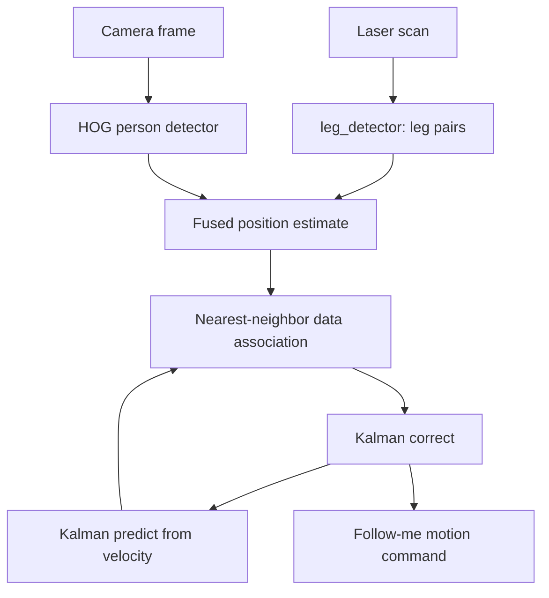

# ROS Perception in 5 Days — Unit 8: People Tracking

This unit generalizes from tracking a face (Unit 6) to tracking a whole person's position over time and across sensors — the capability behind "follow me" robot behaviors, and the last building block before the capstone project in Unit 9.

The diagram below shows how laser and vision detections feed a fused estimate, which the predict-associate-correct Kalman loop keeps stable frame to frame.



## Full-body vs. face-only tracking
A face detector only works while the person faces the camera; a person who turns sideways or walks away disappears from a face-only pipeline. Full-body (or upper-body/legs) detection keeps tracking through those cases. ROS 1 commonly pairs a laser-based leg detector with vision:
- `leg_detector` clusters 2D laser scan returns into leg-shaped pairs and publishes candidate person positions — robust to lighting, works even with the person's back turned.
- A vision-based person/pedestrian detector (HOG+SVM in OpenCV, or a deep detector) adds a visual confirmation and works well when the laser is ambiguous (e.g. crowded scenes).

```python
hog = cv2.HOGDescriptor()
hog.setSVMDetector(cv2.HOGDescriptor_getDefaultPeopleDetector())
boxes, weights = hog.detectMultiScale(frame, winStride=(8, 8))
```

## Maintaining identity across frames: the tracking problem
Detection alone gives you a new set of boxes/positions every frame with no notion of "this is the same person as last frame." Tracking adds continuity, typically with a simple Kalman filter per tracked person: predict the next position from velocity, then correct with the new detection.
```python
# conceptual sketch, not a full implementation
predicted = kalman.predict()                 # where do we expect the person now?
matched_detection = nearest(predicted, detections)  # nearest-neighbor data association
kalman.correct(matched_detection)
```
This predict-associate-correct loop is what lets tracking survive a single missed detection (occlusion, motion blur) without losing the person entirely — a strict "redetect every frame with no memory" approach loses the target the moment one frame fails.

## Fusing laser and vision estimates
When both a leg detector and a vision detector are available, fuse their position estimates rather than trusting either alone — laser gives reliable range/bearing but no identity information; vision gives richer information (and, combined with Unit 7, identity) but degrades with occlusion and lighting. A common approach is to use the laser-based position as the primary tracked state and use vision detections to confirm or re-anchor the track when it drifts.

## From tracked position to "follow me" behavior
Once you have a stable `(x, y)` estimate of the tracked person in the robot's frame, following is a navigation problem, not a perception one: publish a goal position offset from the person (e.g. 1 meter behind their direction of travel), or drive velocity commands proportional to distance and bearing error, same as the P-controllers from earlier units, just now closing the loop over a full-body track instead of a face or blob.

## Try it yourself
Using either a laser scanner with `leg_detector` or a camera with an HOG person detector (whichever you have available), track one person as they walk across the robot's field of view, including briefly stepping behind an obstacle. Log the tracked position over time and verify the track survives the brief occlusion rather than dropping and restarting.
