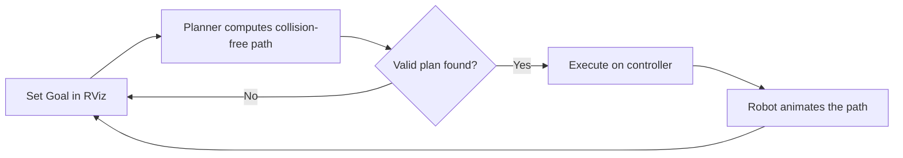

# ROS Manipulation in 5 Days — Unit 1: Introduction to the Course

This unit orients you to what "ROS Manipulation" actually means, the toolchain you'll be using all week (MoveIt on top of ROS), and how the next six units build on each other so you always know where a given skill fits into the bigger pick-and-place picture.

The diagram below shows the set-goal-plan-execute loop that every unit in this course, and every MoveIt-driven robot, repeats:



## What "manipulation" means in ROS

In robotics, manipulation is any task where a robot changes the state of its environment through contact — picking up a part, turning a valve, inserting a peg, opening a door. In ROS terms, that almost always means: a kinematic chain (the arm), an end effector (gripper, sucker, or hand), a planner that computes a collision-free path from the current state to a goal state, and a controller that executes that path on real or simulated joints. Manipulation sits on top of everything you already know about ROS nodes, topics, and TF — it adds motion planning and collision checking as the new pieces.

The dominant framework for this in the ROS ecosystem is **MoveIt** (moveit.picknik.ai), which wraps kinematics solvers, motion planners (OMPL by default), collision checking, and trajectory execution behind a consistent API and a set of RViz plugins. This course teaches you MoveIt specifically, not because it's the only option, but because it's the framework you'll meet in almost every ROS manipulation job, paper, or tutorial.

## The shape of this 5-day course

Each unit maps to one concrete skill, and skills compound:

1. **Introduction** (this unit) — vocabulary and orientation.
2. **Basic Concepts** — URDF, TF, joints, and planning groups: the model MoveIt reasons about.
3. **Motion Planning Part 1** — build a MoveIt configuration package with the Setup Assistant and plan visually in RViz.
4. **Motion Planning Part 2** — add a depth sensor so the planner avoids obstacles it wasn't told about in advance.
5. **Programmatic Motion Planning** — drive the same planning pipeline from Python code instead of clicking in RViz.
6. **Grasping** — close the loop: detect a graspable pose, pick an object up, place it somewhere else.
7. **Project** — combine everything into one pick-and-place task you design and run yourself.

By the end you should be able to take an arbitrary manipulator URDF, generate a MoveIt package for it, and write a Python node that picks something up — the same workflow used for industrial arms, research platforms, and simulated robots alike.

## Confirming your environment

Before diving into concepts, get a minimal demo running so you know your ROS + MoveIt install works. Most MoveIt-enabled robot packages ship a demo launch file that spins up RViz with a preconfigured planning scene and a fake ("dummy") controller — no real hardware needed:

```bash
# ROS 2 example — package name varies by robot (e.g. moveit_resources, panda_moveit_config)
ros2 launch moveit_resources_panda_moveit_config demo.launch.py

# ROS 1 equivalent
roslaunch panda_moveit_config demo.launch
```

If RViz opens with a robot model, an interactive marker on the end effector, and a "Motion Planning" panel on the left, you're ready. Drag the marker, hit **Plan**, then **Execute** — you should see the robot animate a collision-free path. That loop (set goal → plan → execute) is the mental model for the entire course.

## Try it yourself

Install (or confirm you already have) MoveIt for whichever ROS distro you're using, run a demo launch file for any sample robot (Panda and UR arms are common choices with ready-made MoveIt configs), and get a single plan-and-execute cycle working in RViz. Note down the exact package and launch file name you used — you'll reuse the same pattern when you build your own MoveIt config in Unit 3.
