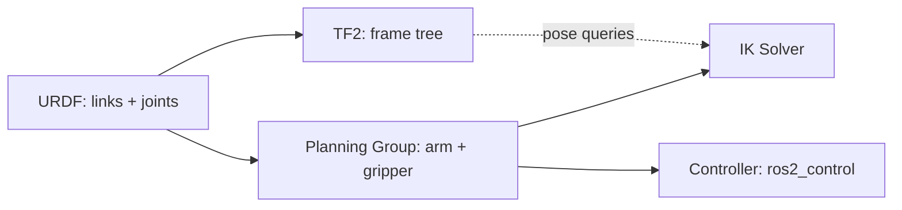

# ROS Manipulation in 5 Days — Unit 2: Basic Concepts

Before you can build or drive a MoveIt package, you need the vocabulary and data structures MoveIt itself reasons about: how a robot's geometry and joints are described, how frames relate to each other over time, and what a "planning group" actually is. This unit gives you that foundation so the rest of the course reads as configuration rather than magic.

The diagram below shows how these concepts relate to each other, from the robot description down to what actually moves the joints:



## URDF and kinematic chains

A manipulator is described to ROS as a **URDF** (Unified Robot Description Format) — an XML tree of `<link>` elements (rigid bodies) connected by `<joint>` elements (revolute, prismatic, fixed, continuous). MoveIt parses this tree to know which links move relative to which, what the joint limits are, and what the arm's kinematic chain looks like from base to end effector.

```xml
<joint name="shoulder_pan_joint" type="revolute">
  <parent link="base_link"/>
  <child link="shoulder_link"/>
  <axis xyz="0 0 1"/>
  <limit lower="-3.14" upper="3.14" effort="150" velocity="3.15"/>
</joint>
```

In practice you'll usually write this with **Xacro** (macros that expand into URDF) so you don't repeat boilerplate for every joint/link pair. You don't need to hand-write a full arm URDF for this course — most vendors and simulators ship one — but you do need to be able to read one and identify the base link, the end-effector link, and the joint chain between them.

## TF2 and coordinate frames

Every link in the URDF gets a corresponding **TF frame**, and TF2 continuously publishes the transform between every pair of connected frames as the robot moves. Manipulation code constantly asks TF questions like "where is the gripper relative to the object?" or "what's the pose of `tool0` in the `base_link` frame right now?":

```bash
ros2 run tf2_ros tf2_echo base_link tool0
# or, for the whole tree at once:
ros2 run tf2_tools view_frames   # ROS 1: rosrun tf view_frames
```

Get comfortable with `tf2_echo` and the frame tree viewer early — nearly every manipulation bug ("the arm moved to the wrong place") turns out to be a frame mix-up, not a planner bug.

## Joints, controllers, and planning groups

MoveIt doesn't move joints directly; it hands a planned trajectory to a **controller** (via `ros2_control` in ROS 2, or a controller_manager in ROS 1) that actually commands the hardware or simulator. Between the URDF and the controller sits the concept a **planning group** — a named subset of joints that MoveIt plans for together, defined in the SRDF (Semantic Robot Description Format). A typical arm has at least two groups: `arm` (the joints from base to wrist) and `gripper` (the end-effector joints). You'll define these explicitly in Unit 3 using the MoveIt Setup Assistant.

## Key terms you'll use all week

- **Planning scene** — MoveIt's internal model of the world: robot state plus known obstacles, used for collision checking.
- **End effector** — the link (or group) that does the actual interacting: gripper, sucker, hand.
- **Pose goal vs. joint goal** — a target expressed as a Cartesian pose (position + orientation) versus as explicit joint angles.
- **IK (inverse kinematics)** — solving "what joint angles put the end effector at this pose?", handled by a solver plugin (e.g. KDL, or a vendor-specific analytic solver).

## Try it yourself

Pick any manipulator URDF you have access to (a sample from `moveit_resources`, a UR or Panda description package, or one you've written). Load it in RViz with `robot_state_publisher` and `joint_state_publisher_gui`, move the sliders, and use `tf2_echo` to read the transform between the base link and the end-effector link at two different joint configurations. Confirm the numbers change the way you'd expect from the joint you moved.
