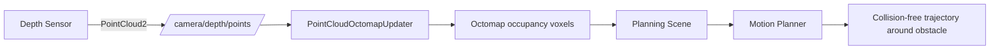

# ROS Manipulation in 5 Days — Unit 4: Motion Planning using Graphical Interfaces Part 2

The MoveIt config from Unit 3 only knows about obstacles you described explicitly in the URDF. Real environments have objects the robot was never told about — a box someone left on the table, a person walking past. This unit adds perception to your planning scene so the planner avoids what a depth sensor actually sees, still driven entirely from RViz and launch files.

The diagram below traces how depth data flows from the sensor into the planning scene and finally shapes the planned trajectory:



## Why perception matters for planning

MoveIt's planning scene is a monitored, continuously-updated model of "what's collidable right now." Without a sensor feed, that model is static: whatever collision objects you hard-coded or added by hand in RViz. With a sensor feed, MoveIt can build a live occupancy representation of the world and treat it as additional collision geometry, so a plan that looked clear at startup gets rejected or replanned if something now blocks it. This is the difference between a robot that only avoids obstacles a programmer anticipated and one that avoids obstacles it's currently looking at.

## Octomap and the point cloud pipeline

MoveIt's standard mechanism for this is the **Octomap** — a 3D occupancy grid built incrementally from depth data (a point cloud or a depth image) via `octomap_updater` plugins configured in your MoveIt package. The pipeline is: depth sensor → point cloud topic → `PointCloudOctomapUpdater` (or `DepthImageOctomapUpdater`) → occupancy voxels merged into the planning scene as an `octomap` collision object.

You enable this in the `sensors_3d.yaml` file that the Setup Assistant scaffolds (empty, by default) for your MoveIt config package:

```yaml
sensors:
  - sensor_plugin: occupancy_map_monitor/PointCloudOctomapUpdater
    point_cloud_topic: /camera/depth/points
    max_range: 3.0
    point_subsample: 1
    padding_offset: 0.02
    filtered_cloud_topic: filtered_cloud
```

The `octomap_resolution` (voxel size, in meters) is set alongside this in the planning scene monitor launch args — coarser resolution is faster to update and plan against, finer resolution catches smaller obstacles but costs more compute.

## Wiring a sensor into the demo launch

Whether you're using a real RGB-D camera, a simulated one, or a bag file, the requirement is the same: something must publish a `sensor_msgs/PointCloud2` (or depth image + camera info) on the topic named in `sensors_3d.yaml`. In simulation this is usually a depth camera plugin attached to a sensor link in your world/URDF; on hardware it's the camera driver's own publisher. Add (or confirm) that topic is publishing, then relaunch your MoveIt demo — RViz's Motion Planning display has a "Scene Geometry" section where you can toggle the Octomap's visibility to confirm voxels are appearing where your sensor sees geometry.

## Testing collision-aware planning

With the octomap live, place a physical (or simulated) object in the arm's workspace that it wasn't told about at config time, and try planning a pose goal on the far side of it. A correctly wired setup will refuse a plan straight through the object and instead route around it, or fail with a clear "no solution found" if there's genuinely no free path. If plans keep going straight through your obstacle, check the topic name match between your sensor's publisher and `sensors_3d.yaml` first — that's the most common wiring bug.

## Try it yourself

Add a `sensors_3d.yaml` entry pointing at a depth topic (real, simulated, or from a recorded bag), relaunch your MoveIt demo, and confirm octomap voxels render in RViz over a known object. Then plan a pose goal that requires the arm to route around that object and verify the resulting trajectory visibly bends around it rather than passing through.
