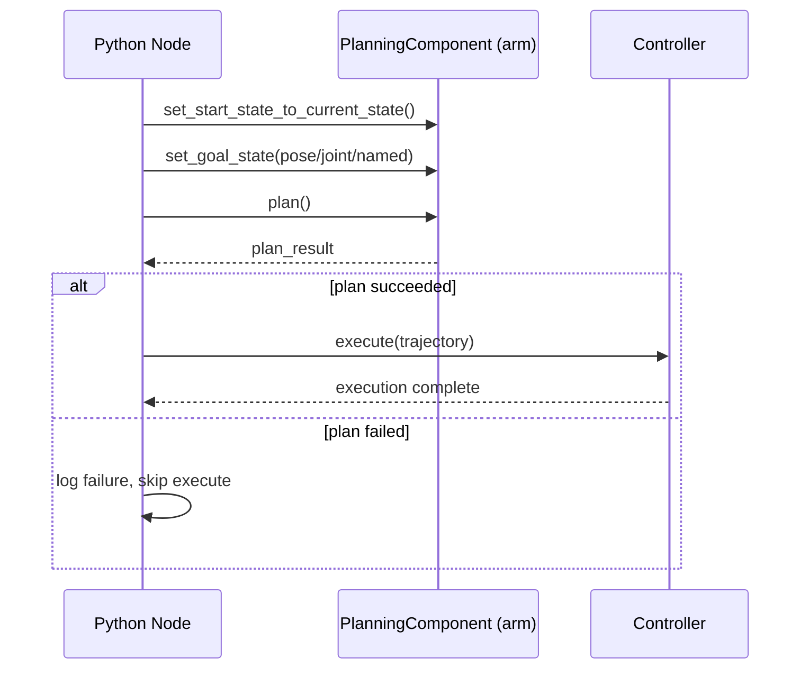

# ROS Manipulation in 5 Days — Unit 5: Perform Motion Planning Programmatically

Clicking targets in RViz is great for building intuition, but a real application needs to plan from code — reacting to perception output, looping over a list of goals, or responding to a service call. This unit moves the same plan/execute cycle from Units 3–4 into Python using MoveIt's programmatic interface.

The sequence below shows the calls your Python node makes and how a failed plan short-circuits execution:



## The MoveGroup interface

MoveIt exposes a high-level Python API for exactly this: `moveit_commander` in ROS 1 and the `moveit_py` bindings (or the `MoveGroupInterface`/`moveit2_py` wrapper packages, depending on distro) in ROS 2. Regardless of the exact package name, the shape is the same: you construct an object bound to a planning group name, set a goal, and call plan/execute.

```python
# ROS 2 style, using moveit_py
from moveit.planning import MoveItPy

moveit = MoveItPy(node_name="moveit_py_planning")
arm = moveit.get_planning_component("arm")

arm.set_start_state_to_current_state()
arm.set_goal_state(configuration_name="home")  # named pose saved in the SRDF

plan_result = arm.plan()
if plan_result:
    moveit.execute(plan_result.trajectory, controllers=[])
```

The underlying sequence — set start state, set goal, plan, check success, execute — is identical to what RViz's Motion Planning panel does when you click Plan and Execute; you're just calling the same machinery directly.

## Setting goals: pose vs. joint vs. named

You can target a planning group three ways, and picking the right one matters:

- **Pose goal** — a Cartesian position + orientation for the end effector; MoveIt runs IK internally to find joint angles. Most natural when the goal comes from perception (e.g. "go to this detected object's pose").
- **Joint goal** — explicit joint values. Deterministic and avoids IK ambiguity, useful for known configurations.
- **Named/stored goal** — a pose saved in the SRDF via the Setup Assistant (like `home` from Unit 3). Best for fixed waypoints you reuse constantly.

```python
from geometry_msgs.msg import PoseStamped

target = PoseStamped()
target.header.frame_id = "base_link"
target.pose.position.x = 0.4
target.pose.position.z = 0.3
target.pose.orientation.w = 1.0
arm.set_goal_state(pose_stamped_msg=target, pose_link="tool0")
```

## Cartesian paths and constraints

Free planning finds *a* collision-free path, but it doesn't guarantee a straight line — fine for reaching, wrong for something like sliding along a table surface. For that, use Cartesian path planning, which interpolates waypoints and asks IK to follow them directly rather than sampling freely:

```python
waypoints = [start_pose, mid_pose, end_pose]
fraction = arm.compute_cartesian_path(waypoints, eef_step=0.01)
```

You can also constrain orientation during free planning (e.g. "keep the gripper level while moving," useful for carrying a filled cup) by attaching an `OrientationConstraint` to the goal before planning.

## Try it yourself

Write a short Python node that, on startup, plans and executes a move to your `home` named pose, then plans and executes a pose goal you compute in code (not by dragging a marker), and finally attempts a Cartesian path between two nearby points. Print whether each planning call succeeded, and deliberately request a pose goal you know is unreachable (e.g. behind the robot's base) to see how a failed plan is reported.
