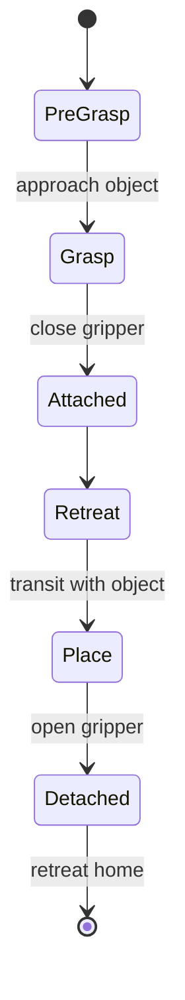

# ROS Manipulation in 5 Days — Unit 6: Grasping

Motion planning gets the end effector to a pose; grasping is what makes the trip worthwhile. This unit covers how to define a grasp, sequence a pick-and-place task around it, and tell the planning scene that an object is now attached to (and later detached from) the robot.

The state diagram below shows the pick-and-place task as the state machine it actually is:



## What defines a grasp

A grasp is more than one target pose — it's typically a small sequence: a **pre-grasp** pose (approach point, gripper open, offset from the object along the approach axis), the **grasp** pose itself (gripper positioned around the object), a gripper-close action, and a **retreat** pose (usually straight back along the approach axis, to avoid dragging the object through other geometry). MoveIt models this with the `moveit_msgs/Grasp` message, which bundles the grasp pose plus pre-grasp/grasp posture (gripper joint states) and approach/retreat directions in one structure that the `pick()` planning call consumes directly.

```python
from moveit_msgs.msg import Grasp
from geometry_msgs.msg import PoseStamped

grasp = Grasp()
grasp.grasp_pose = grasp_pose_stamped        # PoseStamped for the gripper at the object
grasp.pre_grasp_approach.direction.vector.x = 1.0
grasp.pre_grasp_approach.min_distance = 0.05
grasp.pre_grasp_approach.desired_distance = 0.10
grasp.post_grasp_retreat.direction.vector.z = 1.0
grasp.post_grasp_retreat.min_distance = 0.05
grasp.post_grasp_retreat.desired_distance = 0.15
```

## Where the grasp pose comes from

For this course, the simplest and most reliable source is a **heuristic grasp**: given an object's known pose and rough dimensions (from a known model, or a bounding box from perception), compute a fixed offset — e.g. "approach from directly above, gripper z-axis pointing down, centered on the object's centroid." This is enough for regular shapes (boxes, cylinders, mugs by the body) and is exactly what most pick-and-place tutorials teach first. More advanced pipelines swap this step for a learned or sampled grasp generator that scores many candidate grasps against the object's point cloud — worth knowing exists, but not something you need to reach for until heuristic grasps stop being good enough.

## The pick-and-place sequence

A full task is a state machine, not a single call: move to a pre-grasp/observation pose → (perceive object if not already known) → compute grasp → execute pre-grasp approach → close gripper → attach object to planning scene → retreat → transit to place location → open gripper → detach object → retreat again. MoveIt's `pick()` and `place()` helpers on the move group interface can drive the approach/retreat/gripper-posture portion of this automatically given a `Grasp` message; the perception and place-pose logic around it is yours to write.

## Attaching and detaching objects

Once the gripper closes on an object, the planning scene needs to know the object now moves *with* the end effector — otherwise subsequent plans will either collide with it (treated as a static obstacle in its old location) or ignore it entirely:

```python
planning_scene_interface.attach_object(object_id, link_name="gripper_link")
# ... move to place location, open gripper ...
planning_scene_interface.detach_object(object_id)
```

Attaching adds the object's collision geometry to the robot's own collision model (excluded from self-collision checks against the fingers holding it) for the duration of the carry, then detaching returns it to being an independent, stationary collision object at its new pose.

## Try it yourself

Using a simple box or cylinder as your target object (a real one, or a `CollisionObject` added directly to the planning scene), compute a heuristic top-down grasp pose from its known position and dimensions, build a `Grasp` message with sensible pre-grasp/retreat offsets, and run a full pick: approach, close gripper, attach, retreat. Confirm in RViz that the object's collision geometry visibly moves with the gripper once attached.
