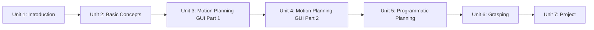

# ROS Manipulation in 5 Days

This course teaches ROS Manipulation end to end: how a manipulator arm is modeled and reasoned about in ROS, how to turn that model into a working MoveIt configuration through graphical tools, how to extend that configuration with live perception so the planner avoids obstacles it wasn't told about in advance, how to drive the same planning pipeline from Python code, and how to close the loop with grasping so the robot actually picks things up and puts them down. The units build in order — each one assumes the MoveIt package and concepts from the ones before it — culminating in a full pick-and-place project you design and run yourself.

The diagram below shows how each unit's output becomes the next unit's starting point:

1. [Introduction to the Course](01-introduction-to-the-course.md) — A brief introduction to the contents of the Course. Includes a demo.
2. [Basic Concepts](02-basic-concepts.md) — Some basic concepts you need to know in order to complete the Course.
3. [Motion Planning using Graphical Interfaces Part 1](03-motion-planning-using-graphical-interfaces-part-1.md) — How to build a MoveIt package for your Manipulator robot.
4. [Motion Planning using Graphical Interfaces Part 2](04-motion-planning-using-graphical-interfaces-part-2.md) — Add Perception to your MoveIt package.
5. [Perform Motion Planning Programmatically](05-perform-motion-planning-programmatically.md) — How to perform Motion Planning with code (Python).
6. [Grasping](06-grasping.md) — How to perform a basic pick and place task.
7. [Project](07-project.md) — A Project to test what you've learned.
