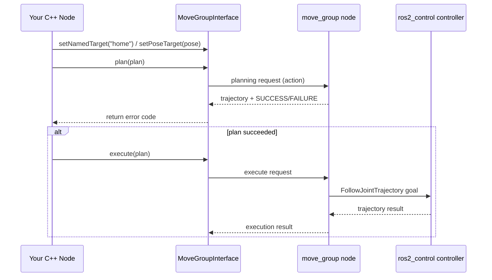

# ROS2 Manipulation Basics — Unit 3: Motion Planning with C++

With a MoveIt2 configuration package in hand, this unit moves you from RViz2's mouse-driven planning to driving the same pipeline programmatically with the Move Group C++ Interface — the API your real applications will actually use.

The sequence diagram below shows the deliberate split between planning and execution as calls flow from your C++ node through `move_group` to the controller.



## The MoveGroupInterface

`moveit::planning_interface::MoveGroupInterface` is a C++ class that wraps the `move_group` node's action and service interfaces behind ordinary method calls. You construct one against a specific planning group (the "arm" group you defined in Unit 2) and a node:

```cpp
#include <moveit/move_group_interface/move_group_interface.h>

auto move_group_interface =
    moveit::planning_interface::MoveGroupInterface(node, "arm");

move_group_interface.setPlanningTime(5.0);
move_group_interface.setMaxVelocityScalingFactor(0.5);
```

Every planning call below hangs off this object. Under the hood it's the same thing RViz2's Motion Planning plugin calls — you're just skipping the GUI.

## Planning to a joint-space goal vs. an end-effector pose

There are two basic ways to specify where you want the arm to go, and picking the right one for the task matters:

**Joint-space goals** specify a target angle for every joint directly. Use these when you know exactly which configuration you want (e.g. a named pose from Unit 2) and don't care about the Cartesian path taken to get there:

```cpp
move_group_interface.setNamedTarget("home");
moveit::planning_interface::MoveGroupInterface::Plan plan;
bool ok = (move_group_interface.plan(plan) ==
           moveit::core::MoveItErrorCode::SUCCESS);
```

**Pose goals** specify a target position and orientation for the end effector, and let the inverse kinematics solver figure out the joint angles. Use these when you care about where the gripper ends up, not how the arm gets there:

```cpp
geometry_msgs::msg::Pose target_pose;
target_pose.orientation.w = 1.0;
target_pose.position.x = 0.4;
target_pose.position.y = 0.1;
target_pose.position.z = 0.3;
move_group_interface.setPoseTarget(target_pose);
```

Either way, `plan()` only computes a trajectory — it does not move anything yet.

## Executing a trajectory

Once `plan()` succeeds, execute it with a separate call:

```cpp
if (ok) {
  move_group_interface.execute(plan);
}
```

Splitting plan from execute is deliberate: it lets you inspect or reject a plan (check its length, sanity-check the path) before committing the robot to actually moving. For quick manual testing without writing any code, `rqt_joint_trajectory_controller` gives you sliders to directly command each joint through your `ros2_control` controllers — useful for confirming your hardware/simulation moves correctly before you start planning against it programmatically.

## Controlling the gripper

Grippers are usually driven separately from the arm. If your gripper controller exposes a `GripperCommand` action, you can call it directly through an `rclcpp_action` client, specifying a target position and max effort. Alternatively, if you set up a gripper planning group in Unit 2, you can control it the same way as the arm — with `MoveGroupInterface` against the "gripper" group and `setJointValueTarget()` or a named target like `"open"`/`"closed"`.

## Approach and retreat motions

Picking an object rarely means planning straight to the grasp pose — you typically **approach** along a short straight line toward the object, close the gripper, then **retreat** back along the same line before continuing. Planning these as ordinary pose goals risks the arm taking an indirect path that collides with the object on the way in. Unit 4 covers the proper tool for this — Cartesian path planning — which is why approach/retreat is usually the first thing you reach for it.

## Try it yourself

In your MoveIt2 configuration package, write a small C++ node that constructs a `MoveGroupInterface` for your arm group, plans to a named `home` pose, executes it, then plans and executes a pose goal 10cm away in one axis. Print `plan()`'s return code at each step so you can see planning failures distinctly from execution failures.
