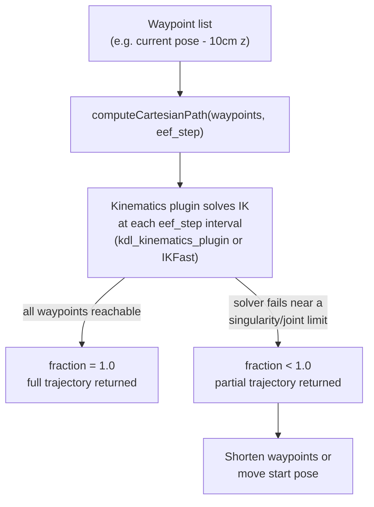

# ROS2 Manipulation Basics — Unit 4: Cartesian Paths & Kinematics Plugin

Joint-space and pose-goal planning (Unit 3) don't guarantee a straight-line path — the planner is free to take any collision-free route. This unit covers Cartesian path planning, where you control the path itself, and the kinematics plugin that underlies every IK solve behind the scenes.

The diagram below shows how a waypoint list becomes a trajectory, with the kinematics plugin doing the per-step IK work that determines the returned `fraction`.



## Cartesian path planning

`computeCartesianPath()` takes a list of waypoints and asks MoveIt2 to interpolate a straight-line (in Cartesian space) trajectory through all of them, rather than just planning to a final goal and letting the planner choose the route:

```cpp
std::vector<geometry_msgs::msg::Pose> waypoints;
geometry_msgs::msg::Pose target = move_group_interface.getCurrentPose().pose;
target.position.z -= 0.10;   // approach: straight down 10cm
waypoints.push_back(target);

moveit_msgs::msg::RobotTrajectory trajectory;
const double eef_step = 0.01;   // resolution, in meters
double fraction = move_group_interface.computeCartesianPath(
    waypoints, eef_step, trajectory);
```

The `fraction` return value tells you how much of the requested path was actually achievable (1.0 = the whole thing). This is exactly the tool for the approach and retreat motions from Unit 3 — a grasp approach that wanders off-axis on the way to the object is much more likely to knock it over or collide with the surface it's sitting on.

Cartesian planning is more restrictive than pose-goal planning: because the path is fixed, there's less freedom for the IK solver to avoid joint limits or singularities along the way. It's normal for `fraction` to come back less than 1.0 near the edges of the workspace — treat that as a signal to shorten the waypoint list or move the start pose, not as a bug.

## The kinematics plugin

Every pose goal and every Cartesian waypoint above is ultimately solved by an **inverse kinematics (IK) plugin** — the component that converts a desired end-effector pose into joint angles. MoveIt2 defaults to `kdl_kinematics_plugin` (from the Kinematics and Dynamics Library), a general-purpose numerical solver that works with any kinematic chain but can be slow and occasionally fails to converge near singularities.

For real applications it's common to swap in a faster or more robust solver — analytic solvers like IKFast (generated specifically for your robot's kinematic chain) or other plugins compatible with the `kinematics_base` plugin interface. You select the plugin per planning group in `kinematics.yaml`, generated as part of Unit 2's configuration package:

```yaml
arm:
  kinematics_solver: kdl_kinematics_plugin/KDLKinematicsPlugin
  kinematics_solver_search_resolution: 0.005
  kinematics_solver_timeout: 0.05
```

If you find planning to pose goals is slow or frequently failing, this file — not your planning code — is usually the first place to look.

## Assembling a full pick and place pipeline

Put the pieces from Units 2–4 together and you have the shape of a pick and place task: plan a joint-space move to a pre-grasp pose above the object, a Cartesian approach straight down to the grasp pose, close the gripper, a Cartesian retreat back up, then a joint-space move to a place location, and finally open the gripper. Notice that every pose in this sequence so far has been hand-typed — Unit 5 replaces those hardcoded numbers with real object coordinates from perception.

## Try it yourself

Extend the node from Unit 3's exercise: after planning and executing to your `home` pose, use `computeCartesianPath()` to move the end effector straight down 5cm, then straight back up 5cm, executing each leg separately. Print the `fraction` returned for each call — if either one comes back below 1.0, try a smaller displacement and see if it improves.
