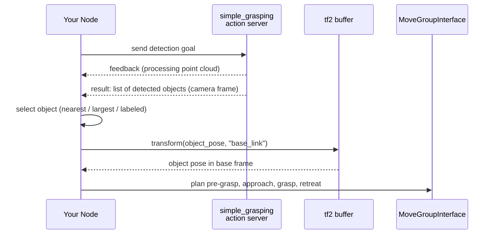

# ROS2 Manipulation Basics — Unit 5: Object Detection with ROS2

Every prior unit planned to poses you typed by hand. This closing unit replaces that with real perception: detecting objects from a depth camera and feeding their positions into the pick and place pipeline from Unit 4, so the robot picks up what's actually in front of it.

The sequence diagram below traces a detected object's pose from the `simple_grasping` action result through frame transformation and object selection to a grasp plan.



## The simple_grasping package and depth camera data

`simple_grasping` is a ROS 2 package that provides basic object detection and grasp-point generation from RGB-D data — enough to bootstrap a pick and place task without writing a perception pipeline from scratch. It works from a **point cloud**: a set of 3D points, each with a position (and often color), produced by a depth camera. Before trusting detections, visualize the raw point cloud in RViz2 to confirm the camera is actually seeing the scene correctly — a `PointCloud2` display subscribed to your camera's cloud topic:

```bash
ros2 topic echo /camera/depth/color/points --once   # confirm data is flowing
```

If the cloud looks noisy, empty, or misaligned with the rest of the scene, fix that before debugging detection logic — most "detection isn't working" problems are actually camera calibration or TF problems.

## Running and reviewing the object detection action

`simple_grasping` exposes its detection as a ROS 2 **action** — appropriate because detection can take a noticeable, variable amount of time, and an action gives you feedback and cancellation instead of a blocking service call. You call it from your own node with an action client, wait for the result, and get back a set of detected objects with estimated bounding boxes.

Reading through the package's own detection code (rather than treating it as a black box) is worth the time here: it clarifies exactly what preprocessing happens to the raw point cloud (cropping to a region of interest, plane segmentation to remove the table surface, clustering the remaining points) before objects come out the other end. Understanding that pipeline is what lets you debug it when detection misses something or hallucinates an object that isn't there.

## Extracting object position and handling multiple detections

Each detected object in the action result carries a pose (typically the centroid of its point cluster) in the camera's frame. Two things matter before you can plan to it:

1. **Transform it into your planning frame.** The detection is in the camera's optical frame; MoveIt2 plans in the robot's base or world frame. Use `tf2` to transform the pose before handing it to `MoveGroupInterface`:

```cpp
geometry_msgs::msg::PoseStamped object_in_camera_frame = /* from detection */;
geometry_msgs::msg::PoseStamped object_in_base_frame =
    tf_buffer.transform(object_in_camera_frame, "base_link");
```

2. **Decide which object you want**, when there's more than one. The action result is a list, not a single pose — a real pipeline needs a selection rule: nearest to the robot, largest cluster, or a specific label if your detector provides one. Don't assume `results[0]` is the object you want; log the full list while developing so you can see what the detector actually returned.

## Wiring perception into pick and place

With a transformed, selected object pose in hand, plug it directly into the pipeline from Unit 4: plan a joint-space move to a pre-grasp pose offset above the detected position, Cartesian-approach down to the grasp pose, close the gripper, and retreat. The only change from Unit 4's hardcoded version is that the target pose now comes from the detection action instead of a literal in your code — everything else in the motion pipeline is unchanged, which is exactly the point of keeping planning and perception as separate, composable pieces.

## Try it yourself

With a depth camera (real or simulated) publishing a point cloud, run `simple_grasping`'s detection action against a scene with two or three objects on a flat surface. Log the full list of detected poses (in the camera frame), then transform each one into your robot's base frame with `tf2` and print the results — confirm the transformed positions are physically plausible (e.g. in front of the robot, above the table height) before wiring them into a planning call.
