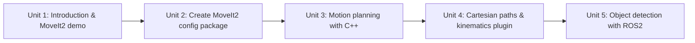

# ROS2 Manipulation Basics

Manipulation is how a robot changes its environment, not just moves through it — grasping, moving, and placing objects. This course builds that capability from the ground up in ROS 2 around MoveIt2: you'll configure a MoveIt2 package for a manipulator arm, drive it programmatically in C++ through joint-space, pose, and Cartesian motion planning, and finally close the loop with perception so the robot plans against objects it has actually detected rather than hardcoded coordinates.

The diagram below shows how each unit's output becomes the next unit's starting point, from initial setup through to a perception-driven pick and place pipeline.

1. [Introduction to the Course](01-introduction-to-the-course.md) — What manipulation and MoveIt2 are, a hands-on demo of a working pipeline, and what you need before starting.
2. [Create a MoveIt2 Configuration Package](02-create-a-moveit2-configuration-package.md) — Use the MoveIt2 Setup Assistant to generate an SRDF, planning groups, poses, end effector, and controllers for your robot.
3. [Motion Planning with C++](03-motion-planning-with-cpp.md) — Drive MoveIt2 programmatically with the Move Group C++ Interface: joint-space and pose goals, execution, and gripper control.
4. [Cartesian Paths & Kinematics Plugin](04-cartesian-paths-and-kinematics-plugin.md) — Plan straight-line Cartesian paths for approach/retreat motions and understand the IK plugin behind every pose goal.
5. [Object Detection with ROS2](05-object-detection-with-ros2.md) — Detect objects with the simple_grasping package and feed real detected positions into a full pick and place pipeline.
