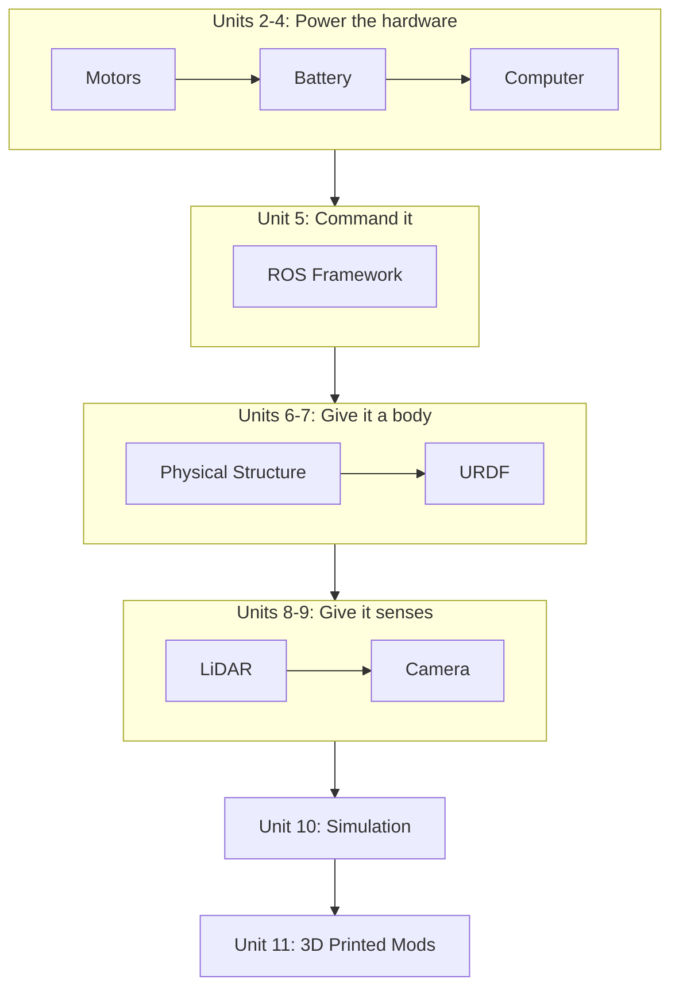

# Build Your First ROS2 Based Robot — Unit 1: Introduction

This unit orients you before any wrench is turned or line of code is written: what robot you're building, what it will be able to do by the end, and what you need to have on hand to follow along.

The diagram below groups the course's units by the phase of the robot they build, showing why the order isn't alphabetical but dependency-driven.

## What you're building
Across this course you'll build a small differential-drive mobile robot — two independently driven wheels plus a caster, a single-board computer running ROS 2, a LiDAR, and a camera — from bare parts to a robot that can be teleoperated, mapped, and simulated. Think of it as the "hello world" of mobile robotics: complex enough to touch every layer of a real robotics stack (mechanical, electrical, firmware, ROS 2 software, simulation), simple enough to finish in a reasonable number of weekends. Every later unit in this course adds exactly one layer on top of the previous one, so nothing you build gets thrown away.

## How the units connect
The course is sequenced deliberately, not alphabetically:
- Units 2-4 (Motors, Battery, Computer) get the physical/electrical hardware chosen and powered.
- Unit 5 (ROS Framework) puts software on that hardware so it can actually be commanded.
- Unit 6-7 (Physical Structure, URDF) give the robot a body and a digital description of that body.
- Units 8-9 (LiDAR, Camera) add senses.
- Unit 10 (Simulation) lets you develop and test against a virtual twin, which is invaluable when the real hardware is unavailable or fragile.
- Unit 11 (3D Printed Mods) is where you extend the design beyond the reference build.

## What you'll need
- A Linux machine (or a Linux VM) with a recent Ubuntu LTS release, since ROS 2 targets Ubuntu first.
- Basic comfort with the command line and with reading wiring diagrams — you don't need prior ROS or electronics experience, just general programming fluency.
- A budget for hardware: a single-board computer (e.g. Raspberry Pi class device), two geared DC motors with encoders, a motor driver board, a LiDAR unit, a camera module, a battery and power regulation board, and structural material (3D-printed or laser-cut chassis parts). Unit-by-unit bill-of-materials details come in each relevant unit.
- Optionally, a second computer to act as your simulation/development machine while the robot's onboard computer stays dedicated to running the robot.

## How to use this course
Each unit below builds one subsystem and ends with a short "conclusion" checkpoint tying it back to the whole robot. Work through them in order the first time — skipping ahead to, say, URDF before the motors and computer are sorted will leave you modeling a robot you can't yet actually drive. If you get stuck, the two most useful habits to build early are: reading error messages fully before searching for them, and keeping a running notes file of every part number and firmware version you use, since robotics debugging is often "which specific version of which specific thing" debugging.

## Try it yourself
Write a one-page build plan for yourself: list the major subsystems (motors, battery, computer, sensors, chassis) and, for each, note whether you already own the part, need to buy it, or need to substitute something you already have. You'll refine this list unit by unit, but starting it now forces you to read the rest of the course with your own hardware in mind rather than in the abstract.
