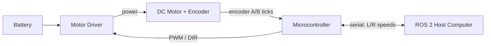

# Build Your First ROS2 Based Robot — Unit 2: Motors

Motors are the robot's muscles, and getting them wrong (too weak, too fast, no feedback) makes every later unit harder. This unit walks through choosing a motor, driving it electrically, wiring it in, and talking to it over serial.

The diagram below shows how power, control signals, and encoder feedback flow between the battery, driver, motor, microcontroller, and the ROS 2 host computer.



## Motor specifications
For a small differential-drive robot you're almost always choosing a brushed DC gearmotor with a built-in quadrature encoder. Three numbers matter most:
- **Stall torque / rated torque** — must exceed what's needed to move the robot's total weight (chassis + battery + compute + payload) up the steepest slope or over the roughest surface you expect, with margin. A rough sizing check: required wheel torque ≈ (robot mass × g × wheel radius) / (number of driven wheels × safety factor of ~2).
- **No-load / rated RPM combined with wheel diameter** — determines top speed: `speed = wheel_circumference × (RPM / 60)`. A gear ratio that's "fast enough" on paper but has poor low-speed torque will make the robot twitchy to control.
- **Encoder resolution (counts per revolution)** — this is what lets ROS 2 later report *odometry* (how far the robot has actually rolled), not just what you commanded it to do. More counts per revolution means finer velocity estimates at low speed.

Pick motors where these three numbers are documented by the manufacturer, not estimated — undocumented "hobby" motors make Unit 5's motor driver node much harder to tune.

## Motor control hardware
A microcontroller's GPIO pin cannot drive a DC motor directly — it can't supply enough current, and it has no way to reverse the motor's direction. That's the job of a **motor driver** (an H-bridge, discrete or integrated into a board like an L298N or a dedicated driver IC). The driver takes a low-power logic signal in and switches high-current motor power out, and lets you set both direction and speed:
- **Direction** is set by which pair of H-bridge switches is enabled.
- **Speed** is set by PWM (pulse-width modulation) — rapidly switching the motor supply on and off; the *duty cycle* (fraction of time on) controls the average voltage the motor sees, and therefore its speed.

The encoder signal runs the other direction: two square-wave channels (A and B), 90 degrees out of phase, feed back into microcontroller interrupt pins so firmware can count ticks and infer both rotation amount and direction.

## Motor wiring
A typical wiring loop looks like this:
```
Battery (+/-) --> Motor Driver power input
Motor Driver PWM/DIR pins <-- Microcontroller GPIO
Motor Driver output A/B --> Motor power leads
Motor encoder A/B/GND/VCC --> Microcontroller digital input pins (+ logic power)
```
Two wiring mistakes cause most of the early pain: swapping a motor's two power leads (the robot spins the wrong way — fix in software by flipping a sign, or physically swap the leads) and under-gauging the wire between battery and driver (voltage sag under load makes the robot behave inconsistently as it accelerates). Keep motor power wiring short and thick, and route encoder signal wires away from the motor power wires to avoid electrical noise corrupting your tick counts.

## Serial communication
The microcontroller that directly drives the motors is usually not the same computer that runs ROS 2 — it's a small, real-time-capable board (e.g. an Arduino-class or STM32-class microcontroller) dedicated to the tight timing loop of reading encoders and updating PWM. That microcontroller talks to the ROS 2 computer over a serial link (USB or UART), using a simple framed protocol, for example:
```
# Host -> microcontroller: set target wheel speeds (rad/s), newline-terminated
"L:0.35,R:0.35\n"

# Microcontroller -> host: report measured wheel speeds
"l:0.34,r:0.36\n"
```
This is the bridge Unit 5 builds on: a ROS 2 node on the host side will translate `/cmd_vel` messages into commands like the one above, and translate encoder reports back into odometry.

## Try it yourself
Using your chosen (or candidate) motor's datasheet, compute the theoretical top speed of your robot in m/s from its no-load RPM and your planned wheel diameter, and compute the theoretical torque available per wheel. Compare torque against a rough estimate of your robot's total weight to sanity-check you're not underpowered before you buy anything.
