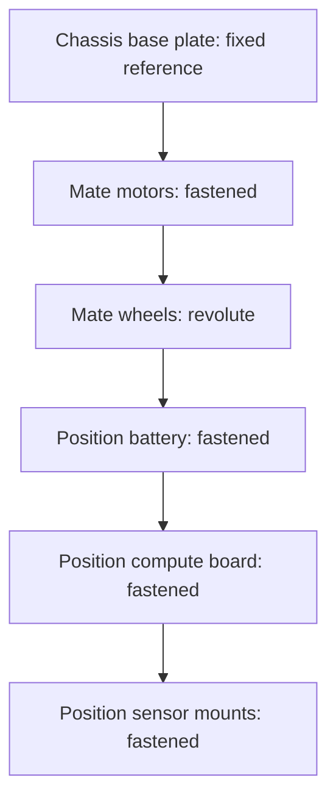

# Build Your First ROS2 Based Robot — Unit 6: Physical Structure Design

With the electronics chosen and the software driving them, this unit gives the robot a body: designing individual chassis parts in CAD, assembling them, and constraining how they fit together.

The diagram below shows the recommended bottom-up order for building the assembly, adding one constrained component at a time on top of the fixed chassis reference.

## Part creation
CAD (computer-aided design) tools let you model each physical piece of the robot — chassis plate, motor mounts, sensor brackets — as precise, parametric 3D geometry rather than a rough sketch. The workflow is broadly the same across tools (Onshape, Fusion, FreeCAD): sketch a 2D profile on a reference plane, then use an operation like *extrude* to turn that profile into a solid, and add features like holes, fillets, or cutouts on top of it.

A few habits that pay off specifically for robot chassis parts:
- **Model to real component dimensions, not round numbers.** Pull exact mounting-hole spacing and body dimensions from your motor, battery, and board datasheets before you sketch — "close enough" holes mean parts that don't fit.
- **Use parametric dimensions (variables) for anything that might change**, like chassis width driven by your chosen wheel track — one variable edit then updates every dependent hole position, instead of you hunting through the model by hand.
- **Design for your fabrication method from the start.** A 3D-printed part tolerates overhangs and complex geometry that a laser-cut flat panel cannot; know which one you're using before you finalize a part's shape.

## Assembly creation
An *assembly* brings multiple parts (and purchased components you didn't design, like the motors and battery) together into one file where their relative positions matter. Most CAD tools let you either design parts directly inside the assembly context or import parts modeled separately — for off-the-shelf components (motors, the SBC, the LiDAR), look for manufacturer-provided 3D models so your assembly reflects real dimensions rather than a rough stand-in box.

Build the assembly bottom-up: start from the chassis base plate as your fixed reference, then bring in and position one component at a time (motors, then wheels, then the battery, then the compute board, then sensor mounts) rather than importing everything at once and trying to sort it out later.

## Mate parts in assembly
*Mates* (also called joints or constraints, depending on the tool) define how parts relate to and move relative to each other — without them, imported parts just float, unconnected. Common mate types you'll use repeatedly:
- **Fastened / rigid** — locks two parts together with no relative motion, e.g. a sensor bracket bolted to the chassis.
- **Revolute** — allows rotation about one axis, e.g. a wheel spinning on its motor shaft.
- **Coincident / concentric** — aligns faces or axes, often used as a building block before adding a fastened or revolute mate on top.

Mating your wheels with revolute joints (rather than fastened) is what lets you later drag them in the CAD tool to sanity-check ground clearance and wheel rotation don't collide with the chassis — the same revolute relationship is also what you'll encode in the URDF joint in Unit 7, so getting the mate right here saves rework later.

## Conclusion
You now have a CAD assembly that represents your robot's real geometry: correctly dimensioned parts, positioned and constrained relative to each other. This assembly is the direct source for two things coming up — the physical parts you'll fabricate, and the URDF model in Unit 7, which is really just this same geometry re-expressed in a format ROS 2 can reason about.

## Try it yourself
In your CAD tool, build a minimal assembly of just the chassis plate and one motor: import or model both, then add a fastened mate to fix the motor to the plate at its correct mounting-hole positions. Confirm the motor shaft ends up where you expect relative to the chassis edge before scaling up to the full robot.
