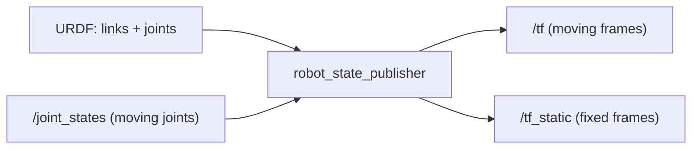

# Build Your First ROS2 Based Robot — Unit 7: URDF (Unified Robot Description Format)

Your CAD assembly is correct geometry, but ROS 2 doesn't read CAD files — it reads URDF, an XML format that describes a robot as links and joints. This unit turns your physical design into that digital model and gets ROS 2 publishing its state.

The diagram below shows how the static URDF file and the live `/joint_states` topic both feed `robot_state_publisher`, which outputs the transform tree the rest of ROS 2 relies on.



## Basic structure of a URDF file
A URDF describes your robot as a tree of `<link>` elements (rigid bodies — chassis, wheel, sensor mount) connected by `<joint>` elements (how one link moves relative to its parent). A minimal two-link example:
```xml
<?xml version="1.0"?>
<robot name="fastbot">
  <link name="base_link">
    <visual>
      <geometry><box size="0.20 0.15 0.05"/></geometry>
    </visual>
    <collision>
      <geometry><box size="0.20 0.15 0.05"/></geometry>
    </collision>
    <inertial>
      <mass value="1.2"/>
      <inertia ixx="0.01" ixy="0" ixz="0" iyy="0.01" iyz="0" izz="0.01"/>
    </inertial>
  </link>

  <link name="left_wheel_link">
    <visual>
      <geometry><cylinder radius="0.03" length="0.02"/></geometry>
    </visual>
  </link>

  <joint name="left_wheel_joint" type="continuous">
    <parent link="base_link"/>
    <child link="left_wheel_link"/>
    <origin xyz="0 0.09 -0.02" rpy="1.5708 0 0"/>
    <axis xyz="0 0 1"/>
  </joint>
</robot>
```
Each element has a distinct job: `<visual>` is what's rendered on screen (can be simplified geometry or a mesh file), `<collision>` is what physics/planning uses for contact checks (often deliberately simpler than `<visual>` for performance), and `<inertial>` gives mass and moment-of-inertia values that a physics simulator needs to behave realistically. `type="continuous"` on the wheel joint means it can rotate freely without limits — the natural choice for a drive wheel, as opposed to `revolute` (bounded rotation, like a robot arm joint) or `fixed` (no motion at all, like a sensor bolted to the chassis).

The `<origin>` and `<axis>` on the joint are exactly the geometric relationship your CAD mates already captured in Unit 6 — you're re-expressing the same wheel position and rotation axis, just in XML instead of a CAD constraint. Getting the numbers from your CAD model (rather than guessing) is what makes the URDF match your physical robot.

## Robot state publisher
Having a URDF file is only half the story — something needs to continuously compute and broadcast where every link actually is right now, as joints move, so the rest of ROS 2 (TF, RViz, navigation) can reason about the robot's current shape. That's `robot_state_publisher`: it reads your URDF once at startup, subscribes to `/joint_states` (the current angle/position of every non-fixed joint), and publishes the resulting tree of transforms on `/tf` and `/tf_static`.
```bash
ros2 run robot_state_publisher robot_state_publisher --ros-args -p robot_description:="$(xacro fastbot.urdf.xacro)"
```
Fixed joints (like a LiDAR bolted to the chassis) are published once on `/tf_static` since they never change; moving joints (wheels) are republished continuously on `/tf` as new `/joint_states` messages arrive. Add `robot_state_publisher` to your bringup launch file from Unit 5 so it starts automatically with the rest of the robot, and visualize the result in RViz to catch geometry mistakes (a wheel floating away from the chassis, an inverted axis) before they cause confusing downstream bugs.

## Conclusion
Your robot now has a digital skeleton: a URDF that matches its real geometry, and a running `robot_state_publisher` keeping every frame's position current. LiDAR and camera data in the next two units will be published in their own sensor frames, and it's this URDF-driven TF tree that lets the rest of the system know exactly where those sensor frames sit relative to the robot as a whole.

## Try it yourself
Write a URDF (or xacro) for just your robot's base and two drive wheels, using the real dimensions from your Unit 6 CAD assembly, launch `robot_state_publisher` with it, and open RViz to confirm the wheels appear in the correct position and orientation relative to the chassis.
