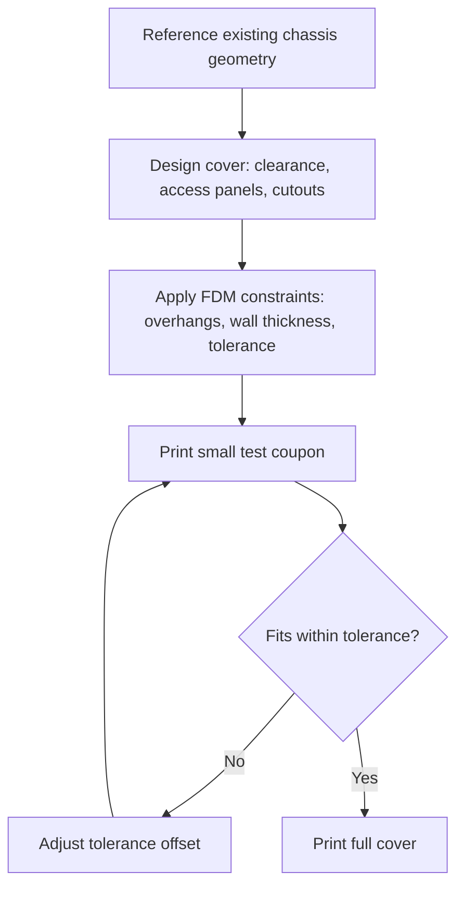

# Build Your First ROS2 Based Robot — Unit 11: 3D Printed Mods: Enhancing Your Robot With Custom 3D-Printed Parts

The reference build gets your robot running end to end; this closing unit is about extending it — designing and printing your own enclosure so your robot looks and holds together like a finished product rather than an exposed prototype.

The flowchart below walks through this unit's design-to-print loop, from referencing your existing chassis geometry to a validated full cover.

## Designing the cover
A cover (or full enclosure) for your robot has to satisfy mechanical and thermal constraints, not just aesthetics — this is where CAD skills from Unit 6 come back into play, now applied to a part that isn't structural but does need to fit precisely:
- **Reuse your existing chassis assembly as the reference geometry.** Model the cover as a part that mates against features already on your chassis (mounting bosses, existing screw holes) rather than guessing dimensions freehand — inconsistency here is the single most common reason a first cover doesn't fit.
- **Leave clearance around anything that generates heat or needs airflow**, particularly the compute board and motor driver — a fully sealed enclosure with no ventilation can cause thermal throttling or shutdowns under sustained load.
- **Provide access without disassembly for anything you'll touch often** — a cutout or removable panel over the SD card slot, USB ports, and the power switch saves you from removing the whole cover every time you need to flash a new image or plug in a debug cable.
- **Route cutouts for anything that needs a clear line of sight or airflow to the outside** — the LiDAR generally needs an unobstructed 360-degree view, and the camera needs a matching opening at the correct angle.

## 3D printing considerations
Designing *for* 3D printing (specifically FDM, the most common consumer process) means respecting a few constraints that CAD alone won't warn you about:
- **Overhangs** — unsupported geometry beyond roughly a 45-degree angle from vertical tends to sag or need support material; orient parts, or add small fillets/chamfers, to minimize overhangs on faces where surface quality matters.
- **Wall thickness** — very thin walls (below roughly 2-3x your printer's nozzle diameter) print weak or fail entirely; err thicker for structural features like screw bosses.
- **Tolerances for fitted parts** — a hole meant to clear a screw or press-fit a bearing usually needs a small clearance offset (commonly 0.1-0.3mm depending on your printer and material) beyond the nominal dimension, since FDM prints slightly undersized holes and oversized pegs by default.
- **Material choice** — PLA is easiest to print and fine for a cover with no significant mechanical load or heat exposure; PETG or ABS tolerate more heat and impact if your enclosure sits near the motor driver or battery.
- **Orientation and layer lines** — parts are weakest across layer lines (perpendicular to the print bed), so orient any part that will experience bending or snapping force so the load runs along, not across, the layers.

Print a small test coupon of any fitted feature (a single screw boss, a single snap-fit clip) before committing to a full-size print — a two-hour test print that reveals a bad tolerance is far cheaper than an eight-hour full enclosure print that doesn't fit.

## Conclusion
With a properly fitted, ventilated cover, your FastBot goes from an assembly of exposed boards and wires to a robot you can actually pick up, carry around, and demo without worrying about shorting something against a stray screwdriver. This is also the natural jumping-off point for your own modifications — sensor mounts, payload bays, or a different chassis shape entirely — using the same CAD-to-print workflow you've now practiced twice.

## Try it yourself
Design and print one small, low-risk fitted feature first — a single cutout or a single screw boss matched to your actual chassis — measure the printed result against your CAD model with calipers, and adjust your tolerance offset before committing to the full cover design.
