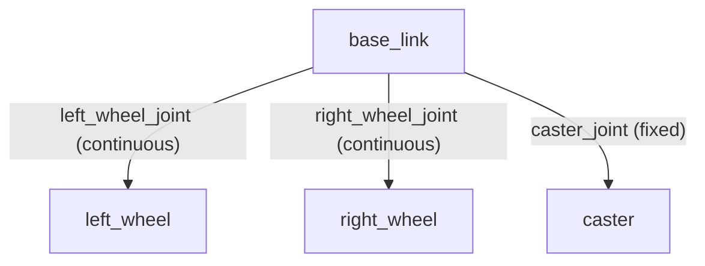

# Create Your First Robot with ROS (Deprecated) — Unit 3: Creating a Simulation of the Robot

Before you connect to the real robot in the next unit, this unit builds a simulated twin you can drive, crash, and debug without consequences. Every controller and navigation script from Unit 5 onward should be exercised here first.

The diagram below shows the link/joint tree that the URDF snippet describes: a base link with two rotating wheel joints and a fixed caster.



## Why simulate before touching real hardware
A simulator gives you three things the real robot can't: infinite retries (no motors to burn out), a perfect ground-truth pose (useful for checking whether your line-follower or SLAM output is actually correct), and the ability to develop on a laptop with no robot present at all. The tradeoff is fidelity — friction, sensor noise, and battery sag never match reality exactly — so treat simulation as where you find *logic* bugs, and reserve real-hardware time for *physical* bugs (traction, lighting, latency).

## Describing the robot: URDF
A simulator needs a formal description of your robot's links (rigid bodies) and joints (how they connect and move) before it can render or physically simulate it. This description is written in URDF (Unified Robot Description Format), an XML dialect. A minimal two-wheeled robot needs a base link, two wheel links connected by continuous (rotating) joints, and a caster:

```xml
<robot name="rosbot">
  <link name="base_link">
    <visual>
      <geometry><box size="0.2 0.15 0.05"/></geometry>
    </visual>
  </link>

  <link name="left_wheel">
    <visual>
      <geometry><cylinder radius="0.04" length="0.02"/></geometry>
    </visual>
  </link>

  <joint name="left_wheel_joint" type="continuous">
    <parent link="base_link"/>
    <child link="left_wheel"/>
    <origin xyz="0 0.1 0" rpy="1.5708 0 0"/>
    <axis xyz="0 0 1"/>
  </joint>
  <!-- right_wheel and its joint mirror left_wheel with a negative y offset -->
</robot>
```
Add `<collision>` geometry alongside `<visual>` so the physics engine has something to compute contacts against — a robot with only visual geometry will fall through the simulated floor.

## Spawning the robot in a simulator
With a URDF (or its more maintainable Xacro-templated form) in hand, load it into a 3D physics simulator — Gazebo is the standard choice in the ROS ecosystem (see gazebosim.org). Typical steps: launch the simulator with an empty world, spawn your robot model into it via the simulator's spawn service/plugin, and add simulated actuator and sensor plugins (differential-drive plugin for the wheels, camera/laser plugins for any sensors) so the simulated robot responds to the same ROS topics your real motor driver will.

## Testing sensors and motion in sim
Once spawned, publish velocity commands the same way you eventually will for the real robot, and confirm the simulated robot moves correctly and its simulated sensors (camera image, laser scan) publish sane data:
```bash
# drive the simulated robot in a circle
rostopic pub /cmd_vel geometry_msgs/Twist "linear: {x: 0.1}
angular: {z: 0.3}" -r 10
# in another terminal, sanity-check a sensor topic is publishing
rostopic hz /camera/image_raw
```

## Try it yourself
Take the wiring diagram you drew in Unit 2 and translate its physical dimensions (wheel spacing, wheel radius, chassis footprint) into a first-pass URDF for your robot. It doesn't need collision meshes or materials yet — just get the links, joints, and dimensions matching your real robot so the simulation you build on top of it behaves like your actual chassis.
