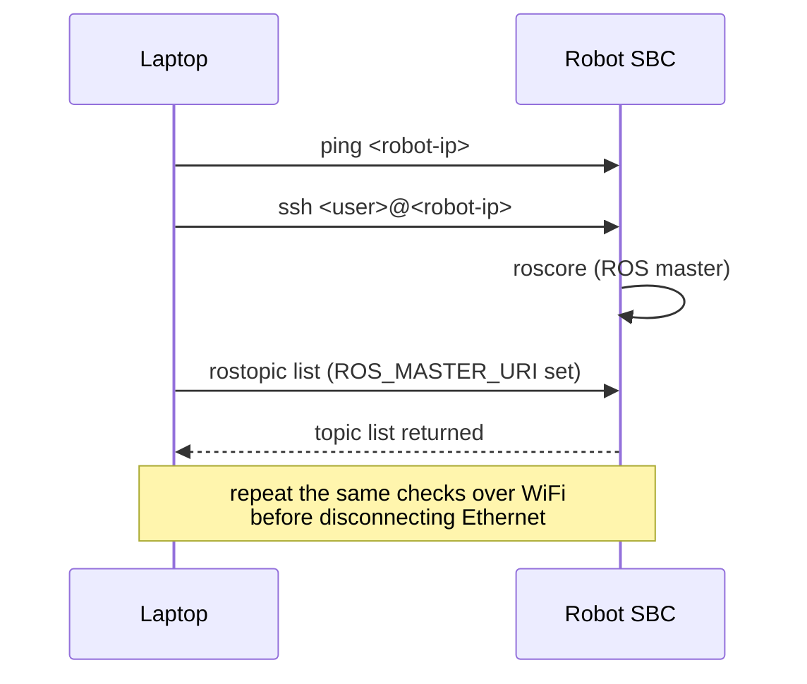

# Create Your First Robot with ROS (Deprecated) — Unit 4: Connecting to the Physical Robot

With a working simulation as your reference behavior, this unit gets your development machine talking to the real robot's onboard computer over the network — first over a wired Ethernet link for reliability while you set things up, then over WiFi so the robot can move untethered.

The sequence below shows the order of connectivity checks: reachability, shell access, starting the ROS master, and confirming the ROS graph is visible, repeated once over WiFi.



## The development-machine / robot split
From here on you're working with two computers: your **development machine** (laptop, where you edit code and watch data) and the robot's **onboard computer** (the SBC from Unit 2, which actually runs the motor driver and talks to the hardware). In classic ROS, exactly one `roscore` master process exists on the network and every other node — on either machine — registers with it. Decide now which machine hosts the master (usually the robot, so it stays operational even if your laptop disconnects) and export `ROS_MASTER_URI` on the other machine to point at it:
```bash
# on the laptop, pointing at the robot's roscore
export ROS_MASTER_URI=http://<robot-ip>:11311
export ROS_IP=<laptop-ip>
```
Both machines also need to resolve each other's hostnames or IPs correctly — mismatched `/etc/hosts` entries are a frequent source of "nodes can't see each other" confusion in classic ROS networking.

## Wired connection first
Connect the robot's SBC to your laptop (directly or via a shared switch/router) with an Ethernet cable and confirm basic reachability before involving ROS at all:
```bash
ping <robot-ip>
ssh <user>@<robot-ip>
```
SSH in and run `roscore` on the robot, then from the laptop with `ROS_MASTER_URI` set correctly, run `rostopic list` — if it returns without error you have a working ROS network link. Debug at this Ethernet layer before ever touching WiFi; it removes an entire class of variables (signal strength, DHCP lease timing) from the problem.

## Setting up WiFi
Once the wired link works, configure the SBC to join your WiFi network (via `nmcli`, `wpa_supplicant`, or your OS's network manager) so the robot can move freely instead of dragging a cable. Give the robot a static IP or a DHCP reservation on your router — a robot whose IP changes every reboot is a constant, avoidable annoyance during development. Re-run the same `ping` / `ssh` / `rostopic list` checks over WiFi to confirm parity with the wired connection before disconnecting the Ethernet cable for good.

## Working remotely without a monitor
Most of the time from here on you'll interact with the robot headlessly. Two habits pay off immediately:
- Use `tmux` or `screen` on the robot's SSH session so long-running processes (like `roscore` or a driver node) survive if your SSH connection drops.
- Keep a terminal on the laptop dedicated to `rostopic echo` or `rqt` visualizations pointed at the robot, separate from the terminal you use to SSH in and launch nodes — mixing the two makes debugging output hard to read.

## Try it yourself
With the robot connected over WiFi, run `roscore` on the robot and, from your laptop, use `rosnode list` and `rostopic list` to confirm you can see the robot's ROS graph with no nodes running on the laptop itself. Then kill the WiFi connection deliberately and observe what `rostopic echo` on the laptop does — understanding that failure mode now will save you real debugging time once the motor driver in Unit 5 depends on this link staying up.
