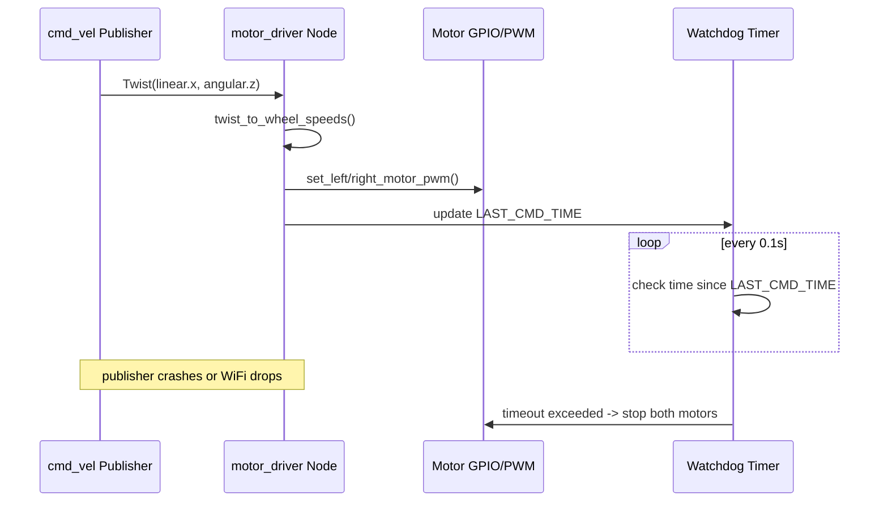

# Create Your First Robot with ROS (Deprecated) — Unit 5: Creating the Motor Drivers

This is the unit where the robot first moves under ROS's control. You'll write the node that turns abstract velocity commands into the actual GPIO signals your driver board expects, and expose it with the same topic interface your simulation from Unit 3 already understands.

The sequence below shows the two paths through the driver node: the normal cmd_vel-to-PWM conversion, and the independent watchdog timer that forces a stop if commands stop arriving.



## From velocity command to wheel speeds
The standard ROS convention for driving a mobile base is to publish `geometry_msgs/Twist` messages on a `/cmd_vel` topic — linear velocity in x, angular velocity in z, for a ground robot. Your driver node's first job is converting that single Twist into two independent wheel speeds using the differential-drive kinematics:
```python
def twist_to_wheel_speeds(linear_x, angular_z, wheel_separation):
    left  = linear_x - (angular_z * wheel_separation / 2.0)
    right = linear_x + (angular_z * wheel_separation / 2.0)
    return left, right
```
`wheel_separation` is the distance between your two wheels' contact points, measured from the wiring diagram you drew in Unit 2 — get this wrong and every future straight-line command will curve.

## Writing the driver node
Wrap that math in a ROS node that subscribes to `/cmd_vel` and writes to GPIO on each callback:
```python
#!/usr/bin/env python
import rospy
from geometry_msgs.msg import Twist
import RPi.GPIO as GPIO  # or your board's equivalent GPIO library

WHEEL_SEPARATION = 0.16  # meters, from your wiring diagram

def cmd_vel_callback(msg):
    left, right = twist_to_wheel_speeds(msg.linear.x, msg.angular.z, WHEEL_SEPARATION)
    set_left_motor_pwm(left)
    set_right_motor_pwm(right)

if __name__ == "__main__":
    rospy.init_node("motor_driver")
    setup_gpio()
    rospy.Subscriber("/cmd_vel", Twist, cmd_vel_callback)
    rospy.spin()
```
`set_left_motor_pwm` / `set_right_motor_pwm` are yours to implement against your specific driver board's datasheet: typically one GPIO pin sets direction and a PWM-capable pin sets speed as a duty cycle. Clamp your output PWM to the board's safe range and treat any speed above what the wheels can physically achieve as a bug, not a feature.

## Safety: timeouts and stop conditions
A driver node that only reacts to incoming messages has a dangerous failure mode: if the publisher (your laptop, or a higher-level navigation node) crashes or the network drops, the robot keeps executing the *last* command forever. Guard against this with a watchdog that stops the motors if no `/cmd_vel` message has arrived recently:
```python
LAST_CMD_TIME = rospy.Time.now()
TIMEOUT = rospy.Duration(0.5)

def watchdog(event):
    if rospy.Time.now() - LAST_CMD_TIME > TIMEOUT:
        set_left_motor_pwm(0)
        set_right_motor_pwm(0)

rospy.Timer(rospy.Duration(0.1), watchdog)
```
Update `LAST_CMD_TIME` inside `cmd_vel_callback`. This single safeguard is the difference between a WiFi hiccup being a minor annoyance and it being a robot driving into a wall unattended.

## Verifying against the simulation
Because your simulated robot in Unit 3 already listens on `/cmd_vel`, you can validate the real driver node with the exact same test commands you used in sim — if `rostopic pub /cmd_vel ...` produced a forward circle in Gazebo, it should produce the same physical motion on the real robot (modulo real-world friction and battery voltage sag).

## Try it yourself
Launch your motor driver node, then in a separate terminal publish a `/cmd_vel` message that should make the robot pivot in place (zero linear velocity, nonzero angular velocity). If it drifts forward or backward instead of pivoting cleanly, your `wheel_separation` constant or your left/right sign convention is off — use that discrepancy to calibrate the constant against your real robot rather than the diagram measurement.
