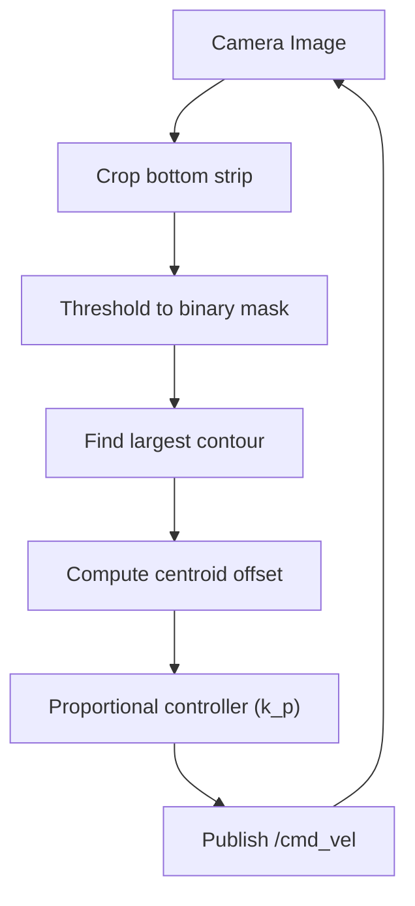

# Create Your First Robot with ROS (Deprecated) — Unit 6: Autonomous Navigation I

With a working motor driver from Unit 5, this unit gives the robot its first real autonomous behavior: a Python vision node that finds a line on the ground and steers the robot to follow it, closing the loop from camera to `/cmd_vel` entirely in software.

The flowchart below traces the perceive-compute-act loop end to end, from a raw camera frame to a steering command and back to the next frame.



## The perception-to-action loop
Line following is a small, complete example of the pattern every autonomous behavior in this course (and in robotics generally) follows: **perceive** the world through a sensor, **compute** an error signal, and **act** by publishing a control command. Here perception is a camera image, the error signal is "how far is the line from the image center," and the action is a `/cmd_vel` message that steers toward zero error. Getting comfortable with this loop now makes the SLAM and deep-learning units feel like variations on a theme rather than unrelated new techniques.

## Detecting the line with OpenCV
A dark line on a light floor (or vice versa) is a good candidate for simple color/threshold-based detection rather than anything learned — save the machine learning for Unit 8. A typical pipeline: crop to a horizontal strip near the bottom of the image (the ground close to the robot), threshold it to a binary mask, and find the centroid of the largest contour:
```python
import cv2
import numpy as np

def find_line_offset(frame):
    h, w, _ = frame.shape
    strip = frame[int(h * 0.8):h, :]              # bottom 20% of the image
    gray = cv2.cvtColor(strip, cv2.COLOR_BGR2GRAY)
    _, mask = cv2.threshold(gray, 60, 255, cv2.THRESH_BINARY_INV)  # dark line
    contours, _ = cv2.findContours(mask, cv2.RETR_EXTERNAL, cv2.CHAIN_APPROX_SIMPLE)
    if not contours:
        return None  # no line visible
    largest = max(contours, key=cv2.contourArea)
    M = cv2.moments(largest)
    cx = int(M["m10"] / M["m00"])
    return cx - (w // 2)  # pixel offset from image center; negative = line is left
```
Tune the threshold value against your actual floor/line contrast — lighting varies enough between rooms that a value that works in one place can fail in another; this is a good moment to appreciate why you tested the perception pipeline in simulation first, where lighting is a controlled variable.

## Turning offset into a steering command
Feed the pixel offset into a simple proportional controller that publishes a `/cmd_vel`:
```python
def offset_to_twist(offset, image_width, forward_speed=0.1, k_p=0.005):
    twist = Twist()
    if offset is None:
        twist.linear.x = 0.0  # line lost: stop rather than guess
        return twist
    twist.linear.x = forward_speed
    twist.angular.z = -k_p * offset
    return twist
```
Start `k_p` small and increase it until the robot tracks the line without oscillating; too high a gain and the robot will visibly zig-zag, too low and it will drift off the line on curves.

## Wiring it together as a node
Subscribe to the camera topic, run both functions in the callback, and publish to `/cmd_vel` — the same topic your Unit 5 driver already listens on, so no changes are needed downstream.

## Try it yourself
Run the line follower in simulation first with a line-textured floor, tune `k_p` there, then transfer the same node to the real robot with no code changes. Note where the behavior differs (usually: real lighting requires a different threshold, and real motor response is slower than the simulated one) — that gap is exactly the "simulation is not reality" lesson worth internalizing before Unit 7's SLAM work.
