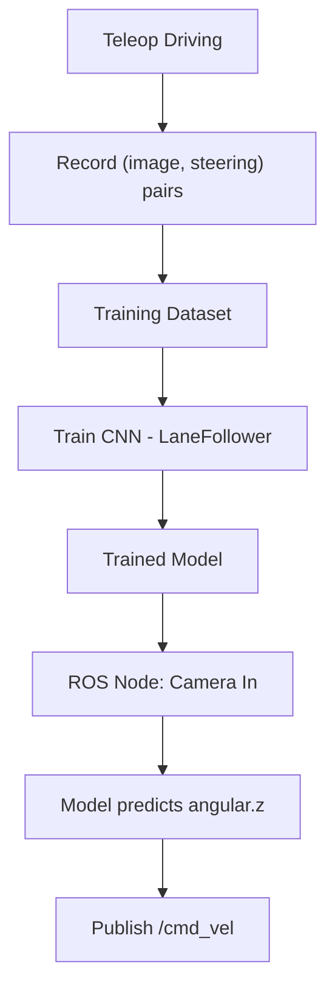

# Create Your First Robot with ROS (Deprecated) — Unit 8: Robot Deep Learning

The final unit replaces the hand-tuned line-follower from Unit 6 with a learned one: a neural network trained on your robot's own camera images to predict steering commands directly, following lanes without any explicit threshold-and-contour logic.

The flowchart below traces the behavior-cloning pipeline from manual demonstration driving to the trained model steering the robot through the same `/cmd_vel` interface as Units 6 and 7.



## Why learn the controller instead of hand-coding it
The Unit 6 line follower worked because the environment was simple enough (a single high-contrast line) that a hand-written threshold pipeline could reliably extract the signal you needed. Real lanes — road-like markings, varying widths, curves, forks — are harder to describe with fixed rules but easy for a human to *demonstrate*. Behavior cloning exploits this: instead of writing the perception logic yourself, you drive the robot manually while recording (image, steering command) pairs, then train a model to imitate that mapping. The model becomes your new controller.

## Collecting training data
Data collection is the part of this workflow most people underinvest in relative to its importance — a model is only as good as the demonstrations it's trained on. Drive the robot manually (teleoperated via keyboard or joystick, publishing to the same `/cmd_vel` your Unit 5 driver consumes) around the lanes you want it to learn, while a recording node logs synchronized camera frames and the steering command in effect at that moment:
```python
import rospy, csv
from sensor_msgs.msg import Image
from geometry_msgs.msg import Twist
from cv_bridge import CvBridge
import cv2

bridge = CvBridge()
latest_angular_z = 0.0
frame_id = 0

def cmd_vel_callback(msg):
    global latest_angular_z
    latest_angular_z = msg.angular.z

def image_callback(msg):
    global frame_id
    cv_image = bridge.imgmsg_to_cv2(msg, "bgr8")
    path = f"dataset/frame_{frame_id:05d}.jpg"
    cv2.imwrite(path, cv_image)
    with open("dataset/labels.csv", "a") as f:
        csv.writer(f).writerow([path, latest_angular_z])
    frame_id += 1
```
Aim for varied conditions (both directions around each lane, a range of speeds, some deliberate near-edge recoveries) — a dataset of only perfect center-of-lane driving teaches the model nothing about how to recover once it drifts.

## Training the model
With a folder of (image, steering) pairs, train a small convolutional network to regress steering angle from image pixels. You don't need a large architecture for lane following at this scale — a handful of convolutional layers followed by a few dense layers is standard in the lane-following literature this style of course draws from:
```python
import torch.nn as nn

class LaneFollower(nn.Module):
    def __init__(self):
        super().__init__()
        self.conv = nn.Sequential(
            nn.Conv2d(3, 16, 5, stride=2), nn.ReLU(),
            nn.Conv2d(16, 32, 5, stride=2), nn.ReLU(),
            nn.Conv2d(32, 64, 3, stride=2), nn.ReLU(),
        )
        self.fc = nn.Sequential(
            nn.Flatten(), nn.Linear(64 * 9 * 14, 100), nn.ReLU(),
            nn.Linear(100, 1),  # predicted angular.z
        )

    def forward(self, x):
        return self.fc(self.conv(x))
```
Train with a standard regression loss (mean squared error) against the logged steering values, holding out a validation split so you can tell overfitting from genuine progress.

## Closing the loop back into ROS
Wrap the trained model in a ROS node structured almost identically to the Unit 6 line follower: subscribe to the camera topic, run the frame through the model instead of the OpenCV contour pipeline, and publish the predicted angular velocity to `/cmd_vel` at a fixed forward speed. Because the interface (`/cmd_vel`) never changed across Units 6, 7, and 8, swapping controllers is a matter of launching a different node, not rewriting the robot.

## Try it yourself
Collect a small dataset (even 5-10 minutes of driving) around one lane, train the model, and run it in simulation first. Before evaluating "did it stay in the lane," first check the boring-but-critical thing: does the model's predicted steering range roughly match the range of steering values in your training data? A model that only ever predicts near-zero steering is a strong sign your dataset lacked enough turning examples, not that your network architecture is wrong.
