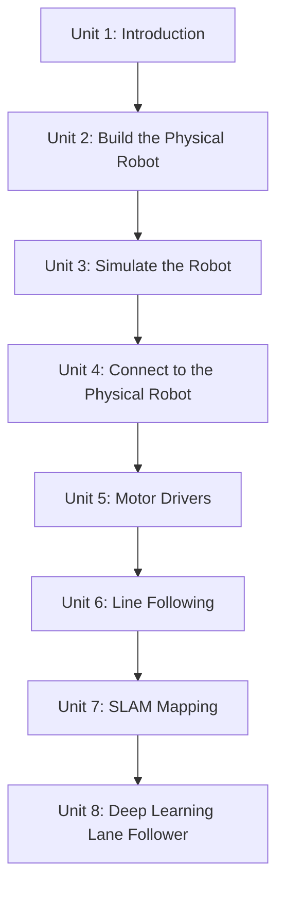

# Create Your First Robot with ROS (Deprecated)

This course takes a two-wheeled robot from a box of parts to an autonomously navigating machine, using classic ROS (catkin, `rospy`/`roscpp`, `roslaunch`) as the software backbone throughout. You'll assemble and wire the physical chassis, build a simulated twin of it so every controller can be developed and tested safely before it ever touches the real hardware, connect your development machine to the robot over Ethernet and then WiFi, and write the motor driver node that turns ROS velocity commands into real wheel motion. From there the course layers on increasingly capable autonomy: a hand-coded computer-vision line follower, monocular SLAM with ORB-SLAM2 for mapping and localizing in unprepared environments, and finally a deep-learning-based lane follower trained on the robot's own driving data. It's marked "deprecated" because it predates ROS 2, but the underlying concepts — nodes, topics, launch files, sim-before-hardware workflow — transfer directly.

The diagram below shows how each unit builds directly on the skills and artifacts produced by the one before it, from bare parts to a learned autonomy controller.

1. [Introduction](01-introduction.md) — Preview of the robot you'll build and how the units connect.
2. [Building the Physical Robot](02-building-the-physical-robot.md) — Mounting the two-wheeled chassis and wiring its electronics.
3. [Creating a Simulation of the Robot](03-creating-a-simulation-of-the-robot.md) — Modeling the robot in URDF and spawning it in a physics simulator.
4. [Connecting to the Physical Robot](04-connecting-to-the-physical-robot.md) — Networking to the robot's onboard computer over Ethernet and WiFi.
5. [Creating the Motor Drivers](05-creating-the-motor-drivers.md) — Writing the ROS node that turns `/cmd_vel` into real wheel motion.
6. [Autonomous Navigation I](06-autonomous-navigation-i.md) — A vision-based line follower using OpenCV.
7. [Autonomous Navigation II](07-autonomous-navigation-ii.md) — Monocular SLAM and mapping with ORB-SLAM2.
8. [Robot Deep Learning](08-robot-deep-learning.md) — Training a neural network to follow lanes from camera input.
