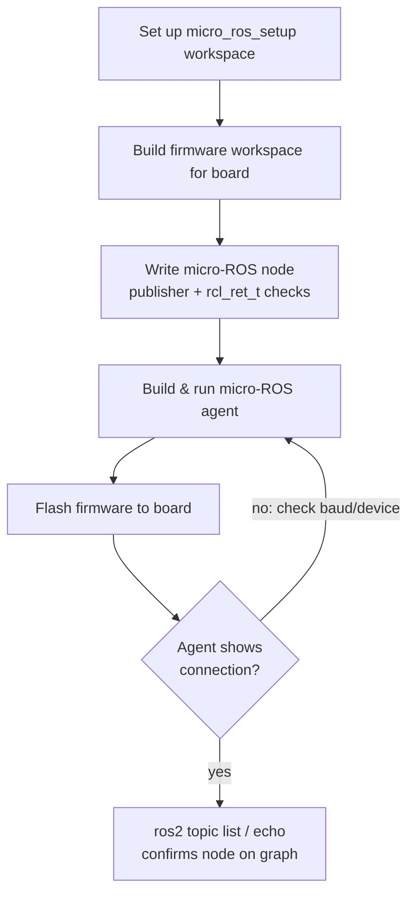

# MicroROS and Electronics for Robotics — Unit 2: A first contact with Micro-ROS

Here you get your hands dirty for the first time: set up a host-side ROS 2 + micro-ROS toolchain, write a minimal micro-ROS publisher, and flash it to a board so it shows up as a real node in `ros2 topic list`. Everything you learn here — the build/flash/agent workflow — is the loop you'll reuse for every remaining unit.

The diagram below traces this build/flash/agent loop end to end, from toolchain setup to confirming the node on the ROS 2 graph.



## Setting up the host-side environment

micro-ROS firmware is built with its own toolchain, `micro_ros_setup`, which wraps the board vendor's SDK (e.g. `esp-idf` for ESP32) and the micro-ROS build system. On your ROS 2 workspace:

```bash
mkdir -p ~/microros_ws/src && cd ~/microros_ws
git clone -b $ROS_DISTRO https://github.com/micro-ROS/micro_ros_setup.git src/micro_ros_setup
rosdep update && rosdep install --from-paths src --ignore-src -y
colcon build --symlink-install
source install/local_setup.bash
```

Then create the firmware workspace for your board and build it once, to pull down the vendor SDK and micro-ROS libraries:

```bash
ros2 run micro_ros_setup create_firmware_ws.sh generate_lib      # host library, if needed
ros2 run micro_ros_setup create_firmware_ws.sh freertos esp32    # firmware workspace for ESP32
ros2 run micro_ros_setup build_firmware.sh
```

## The micro-ROS agent

The agent is the bridge between your MCU and the ROS 2 graph. Build and run it from the same workspace:

```bash
ros2 run micro_ros_setup create_agent_ws.sh
ros2 run micro_ros_setup build_agent.sh
source install/local_setup.bash
ros2 run micro_ros_agent micro_ros_agent serial --dev /dev/ttyUSB0 -b 115200
```

Leave this running in its own terminal. Every micro-ROS node on the MCU connects to this agent over the transport you choose — serial (USB) is simplest to start with; Wi-Fi/UDP is common once the board is untethered.

## Your first micro-ROS node

A minimal micro-ROS C application looks structurally identical to an rclcpp/rclpy node, just in C with explicit memory management:

```c
rcl_publisher_t publisher;
std_msgs__msg__Int32 msg;

rclc_publisher_init_default(
  &publisher, &node,
  ROSIDL_GET_MSG_TYPE_SUPPORT(std_msgs, msg, Int32),
  "micro_ros_platformio_node_publisher");

msg.data = 0;
rcl_ret_t rc = rcl_publish(&publisher, &msg, NULL);
msg.data++;
```

The important habit to build now: every rcl call returns an `rcl_ret_t` — check it. On an MCU there's no exception traceback to fall back on, so silently ignored return codes turn into "the robot just doesn't move" bugs that are painful to trace later.

## Flashing and monitoring

```bash
ros2 run micro_ros_setup flash_firmware.sh
```

Once flashed, with the agent running, confirm the MCU joined the graph from a normal ROS 2 terminal:

```bash
ros2 topic list
ros2 topic echo /micro_ros_platformio_node_publisher
```

If nothing shows up, check the agent's terminal output first — a wrong baud rate or serial device is the most common first-timer mistake, and the agent logs connection attempts.

## Try it yourself

Modify the publisher above to publish an incrementing counter once per second instead of as fast as possible (use `rclc_timer_init_default` with a 1000 ms period and call `rcl_publish` from inside the timer callback, driven by an executor's `spin`). Confirm with `ros2 topic hz` that it settles near 1 Hz.
