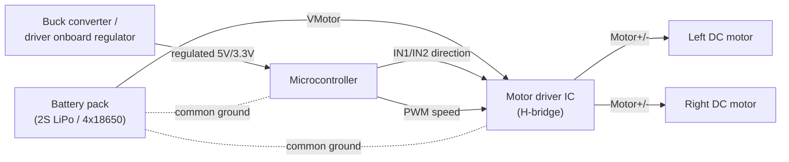

# MicroROS and Electronics for Robotics — Unit 3: Robot Assembly

With the software toolchain proven in Unit 2, this unit is entirely physical: putting PEDRITO's chassis, motors, and power system together correctly before any real firmware goes near it. Getting the wiring right here saves you from chasing "software" bugs later that are actually a loose connector or a reversed motor lead.

The diagram below shows the two separated power domains and the common ground that ties every component together.

## Chassis and mechanical layout

A typical two-wheel differential-drive chassis kit gives you a base plate, two DC gearmotors with wheels, a caster/ball wheel for the third contact point, and standoffs to mount a second deck for electronics. Mount components with maintenance in mind: leave the USB port on the MCU reachable without disassembly, since you'll be reflashing firmware constantly through this course, and keep the battery removable/accessible since you'll be charging or swapping it often.

Route wires along the chassis edges rather than across the middle — wheels and gears will happily eat a loose wire. Zip ties or a bit of cable sleeving pay for themselves the first time a wire gets caught in a gearbox.

## Power distribution

Separate your power domains early: motors draw current in noisy bursts (especially at stall or direction reversal) and can browbeat a shared 5V rail enough to brown out the MCU mid-operation, causing random resets that look exactly like firmware crashes. The standard pattern is:
- A battery pack (commonly 2S LiPo or a 4x18650 pack) feeding the motor driver directly
- A separate regulated 5V (or 3.3V) rail for the MCU and sensors, either from a dedicated buck converter or the motor driver's onboard regulator if it has one
- A common ground between every component — motor driver, MCU, sensors, and battery negative all tied together, even though their supply rails differ

If you ever see the MCU reboot exactly when a motor starts spinning, suspect power/ground before suspecting code.

## Wiring motors through a driver

DC motors are not driven directly from MCU GPIO pins — the current and voltage requirements exceed what a microcontroller pin can safely source. A motor driver IC (e.g. an H-bridge such as the L298N or a more efficient DRV8833-class driver) sits between the MCU's low-current logic pins and the motor's high-current supply:

| Signal | From | To |
|---|---|---|
| IN1 / IN2 (direction) | MCU GPIO | Driver logic input |
| PWM (speed) | MCU GPIO (PWM-capable) | Driver enable/PWM input |
| Motor+ / Motor- | Driver output | Motor terminals |
| VMotor | Battery | Driver power input |
| GND | Shared | Driver, MCU, battery all common |

Wire one motor first, confirm both directions spin correctly with a simple digitalWrite-level test sketch (not micro-ROS yet — plain Arduino/ESP-IDF GPIO toggling is enough), then repeat for the second motor. If a motor spins the wrong way, swap its two motor-terminal wires rather than rewriting software direction logic.

## Sanity checks before moving on

- Measure the regulated rail with a multimeter under no load and confirm it matches the MCU's expected input (commonly 5V or 3.3V — check your board's datasheet).
- With motors disconnected, power the MCU alone and confirm it boots and holds a stable serial connection.
- Only then connect motors and repeat the boot test, watching for resets.

## Try it yourself

Draw (or photograph and annotate) PEDRITO's full wiring diagram — battery, driver, motors, MCU, and grounds — before you power anything on for the first time. Cross-reference it against the driver IC's datasheet pinout. This five-minute check catches the majority of first-assembly wiring mistakes before they become a debugging session.
