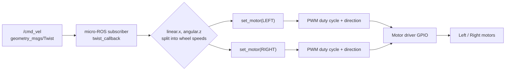

# MicroROS and Electronics for Robotics — Unit 4: Controlling the actuators

Now that PEDRITO is wired, it's time to make it move from ROS 2. This unit connects the physical motor driver from Unit 3 to a micro-ROS subscriber, and along the way covers the two pieces of rclc machinery — timers and executors — that everything in this course depends on.

The diagram below traces a `Twist` command's path from the ROS 2 topic down to the physical motors, matching the control path described below.



## From ROS 2 topic to PWM signal

The control path is: a `geometry_msgs/Twist` (or a simpler custom message, if you'd rather keep dependencies light) published from your PC → received by a micro-ROS subscriber on the MCU → converted to per-wheel PWM duty cycle and direction → written to the motor driver's GPIO pins.

```c
void twist_callback(const void * msgin) {
  const geometry_msgs__msg__Twist * msg = (const geometry_msgs__msg__Twist *)msgin;
  float linear  = msg->linear.x;
  float angular = msg->angular.z;

  float left_speed  = linear - angular;
  float right_speed = linear + angular;

  set_motor(LEFT_MOTOR,  left_speed);
  set_motor(RIGHT_MOTOR, right_speed);
}
```

`set_motor` clamps the speed to [-1, 1], sets the direction pins, and writes a duty cycle to the PWM channel. Keep this conversion function pure and separate from the callback — it's much easier to bench-test "does 0.5 give me a sensible PWM value" without the ROS machinery in the way.

## Timers and executors

A micro-ROS node doesn't "just run" — you build up entities (publishers, subscribers, timers) and hand them to an **executor**, which is a cooperative scheduler that calls your callbacks when data or a timer fires:

```c
rclc_executor_t executor;
rclc_executor_init(&executor, &support.context, NUM_HANDLES, &allocator);
rclc_executor_add_subscription(&executor, &twist_sub, &twist_msg, &twist_callback, ON_NEW_DATA);
rclc_executor_add_timer(&executor, &heartbeat_timer);

while (true) {
  rclc_executor_spin_some(&executor, RCL_MS_TO_NS(10));
}
```

Timers are how you do periodic work that isn't triggered by an incoming message — a heartbeat LED blink, a watchdog that stops the motors if no `Twist` has arrived in the last 500 ms (important: without this, a dropped connection leaves your robot driving blindly into whatever direction it was last told), or a fixed-rate control loop. `NUM_HANDLES` must match the number of entities you register — get it wrong and entities silently fail to attach, another good reason to check return codes.

## LEDs as a debugging tool, not just a feature

Before you trust the motors, wire an external LED (or use the board's onboard one) to a spare GPIO and drive it from a topic too. It's a much faster feedback loop than watching wheels spin, and once you have a `set_led` service/topic working, later units reuse the same pattern for sensor status indicators.

## Try it yourself

Add the 500 ms no-command watchdog described above: a timer that checks the time since the last `Twist` was received and zeroes both motor speeds if it's been exceeded. Test it by publishing a nonzero `Twist` once with `ros2 topic pub --once` and confirming the robot stops moving on its own shortly after, instead of coasting at the last commanded speed forever.
