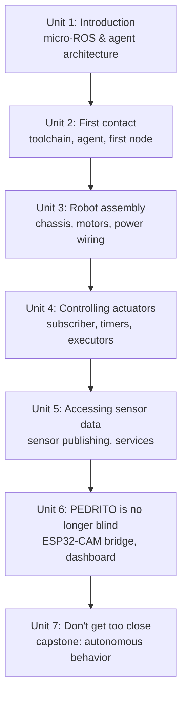

# MicroROS and Electronics for Robotics

This course bridges embedded electronics and ROS 2 by having you build a small differential-drive robot, PEDRITO, from bare chassis to autonomous behavior. You'll set up a micro-ROS toolchain, wire and assemble the physical robot, and progressively bring its motors, sensors, and a camera onto the ROS 2 graph using the same topic/service/timer concepts you already know from desktop ROS 2 — just running on a microcontroller through the micro-ROS agent bridge. By the end, PEDRITO senses its surroundings, streams video, and runs a self-contained obstacle-avoidance behavior triggered through a micro-ROS service.

The diagram below shows how each unit's capability builds directly on the previous one, from toolchain setup through to the capstone autonomous behavior.

1. [Introduction](01-introduction.md) — Course roadmap: what micro-ROS is, the micro-ROS agent architecture, and what PEDRITO will become.
2. [A first contact with Micro-ROS](02-a-first-contact-with-micro-ros.md) — Setting up the host micro-ROS toolchain, running the agent, and flashing a first micro-ROS node.
3. [Robot Assembly](03-robot-assembly.md) — Assembling PEDRITO's chassis and wiring motors, driver, and power domains correctly.
4. [Controlling the actuators](04-controlling-the-actuators.md) — Driving motors and LEDs from ROS 2 topics, plus micro-ROS timers and executors.
5. [Accessing sensor data](05-accessing-sensor-data.md) — Reading and publishing sensor data, and adding micro-ROS services.
6. [PEDRITO is no longer blind](06-pedrito-is-no-longer-blind.md) — Bringing the ESP32-CAM onto the ROS 2 network and building an integrated monitoring dashboard.
7. [Don't get too close](07-dont-get-too-close.md) — Capstone project: a service-armed autonomous obstacle-avoidance behavior.
