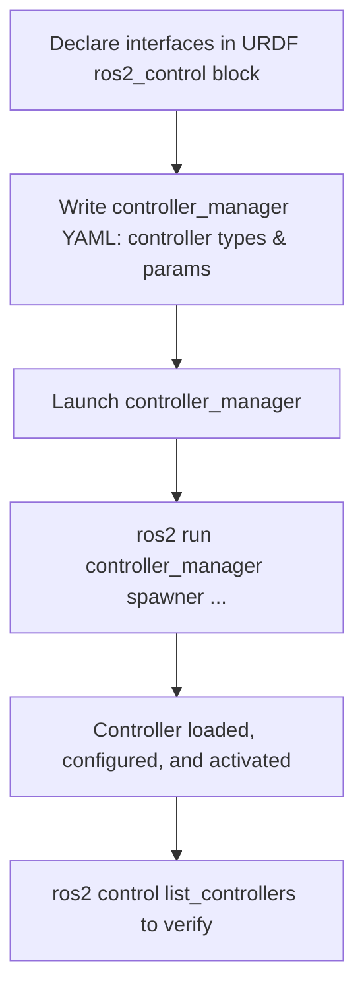

# ROS Control — Unit 3: Configuring the Controllers

With the vocabulary from Unit 2 in hand, this unit is about the practical mechanics of wiring stock controllers onto a robot in simulation: the URDF tag that declares the hardware interface, the YAML file that configures controllers, and the commands that bring them to life. None of this requires writing a line of controller code — everything here is description and configuration, which is exactly why getting it right matters: a typo in a joint name or a mismatched interface type produces a controller that silently refuses to activate rather than a compiler error.

The flowchart below traces the practical steps from declaring interfaces in URDF to a spawned, active controller.



## Declaring the hardware interface in URDF
`ros2_control` expects a `<ros2_control>` block inside (or included from) your robot's URDF/XACRO, describing each joint's available command and state interfaces and which hardware plugin backs them:

```xml
<ros2_control name="MyRobotSystem" type="system">
  <hardware>
    <plugin>gazebo_ros2_control/GazeboSystem</plugin>
  </hardware>
  <joint name="wheel_left_joint">
    <command_interface name="velocity"/>
    <state_interface name="position"/>
    <state_interface name="velocity"/>
  </joint>
  <joint name="wheel_right_joint">
    <command_interface name="velocity"/>
    <state_interface name="position"/>
    <state_interface name="velocity"/>
  </joint>
</ros2_control>
```

The `type` attribute (`system`, `actuator`, or `sensor`) tells the framework how much of the robot this block covers — `system` is the common case for a whole robot or subsystem like an arm, `actuator` scopes a single joint, and `sensor` declares state-only interfaces with no commands (an IMU, for instance). Only declare interfaces a joint actually needs: an unused `position` command interface doesn't just add clutter, it changes what the controller manager thinks is available to claim, which can let a misconfigured controller activate against an interface nothing is really driving.

In simulation the `<plugin>` points at a simulator-provided hardware interface (e.g. `gazebo_ros2_control/GazeboSystem`); on real hardware it points at the custom hardware interface you'll build in Unit 6. In ROS 1's `ros_control`, the equivalent is a `<transmission>` block plus a `hardware_interface::RobotHW` implementation — same idea, older syntax. For robots with many repeated joints, keep the per-joint block in a xacro macro and instantiate it once per joint rather than hand-copying it, the same way you'd macro repeated `<link>`/`<joint>` pairs elsewhere in the URDF.

## The controller configuration YAML
Controllers are configured, not hardcoded — a YAML file lists which controllers to instantiate, their type, and their parameters:

```yaml
controller_manager:
  ros__parameters:
    update_rate: 100  # Hz

    joint_state_broadcaster:
      type: joint_state_broadcaster/JointStateBroadcaster

    diff_drive_controller:
      type: diff_drive_controller/DiffDriveController

diff_drive_controller:
  ros__parameters:
    left_wheel_names: ["wheel_left_joint"]
    right_wheel_names: ["wheel_right_joint"]
    wheel_separation: 0.4
    wheel_radius: 0.1
```

Keeping controller parameters in YAML rather than code means you can retune gains, swap wheel geometry, or point a controller at different joints without recompiling anything. This file is ordinary ROS 2 parameter YAML, loaded onto the `controller_manager` node — typically passed in through your robot's launch file via a `parameters=[...]` argument on the `controller_manager` `Node` action, right alongside the URDF. The `update_rate` here sets how fast the controller manager's `read()`/`update()`/`write()` cycle runs (Unit 2); it should be at or below whatever rate your hardware interface (or simulator) can actually sustain, since asking for 1000 Hz against a plugin that can only deliver 250 Hz just means the loop runs late every cycle.

## Loading and activating controllers
Once the controller manager is running (usually started from your robot's launch file), controllers are *spawned* — loaded, configured, and activated — via a helper:

```bash
ros2 run controller_manager spawner joint_state_broadcaster
ros2 run controller_manager spawner diff_drive_controller
```

Under the hood, `spawner` is just a thin CLI wrapper around the same service calls the controller lifecycle exposes directly (`load_controller`, `configure_controller`, `switch_controller` — the same `unconfigured → inactive → active` transitions from Unit 4's state diagram). If a controller manager isn't running under the default name, or you're working with a namespaced robot, point the spawner at it explicitly with `--controller-manager /my_robot/controller_manager`.

Most launch-file setups call the same `spawner` as a launch action so the whole robot comes up with its controllers already active, e.g.:

```python
Node(
    package="controller_manager",
    executable="spawner",
    arguments=["diff_drive_controller"],
)
```

Order matters loosely: `joint_state_broadcaster` is conventionally spawned first since almost everything else (RViz, TF) depends on `/joint_states` existing.

## Verifying and troubleshooting
Before sending any commands, confirm both controllers actually reached the `active` state:

```bash
ros2 control list_controllers
# joint_state_broadcaster[joint_state_broadcaster/JointStateBroadcaster] active
# diff_drive_controller[diff_drive_controller/DiffDriveController]      active
```

If a controller shows up as `inactive` or fails to spawn at all, the cause is almost always one of three things: the YAML's joint names don't match the URDF exactly (case and suffix included), the controller is asking for a command or state interface the `<ros2_control>` block never declared (the interface-claiming check from Unit 2), or the controller manager simply isn't running yet when the spawner tries to connect. `ros2 control list_hardware_interfaces` shows you what's actually available to claim, which is usually the fastest way to spot which of the three it is.

## Try it yourself
Take a differential-drive robot description (your own from an earlier course, or any simulator example package) and write a `controller_manager` YAML that loads a `joint_state_broadcaster` and a `diff_drive_controller` for it. Launch the robot, spawn both controllers, confirm with `ros2 control list_controllers` that both reached `active`, then confirm with `ros2 topic echo /joint_states` that state is flowing before you try sending any velocity commands.
